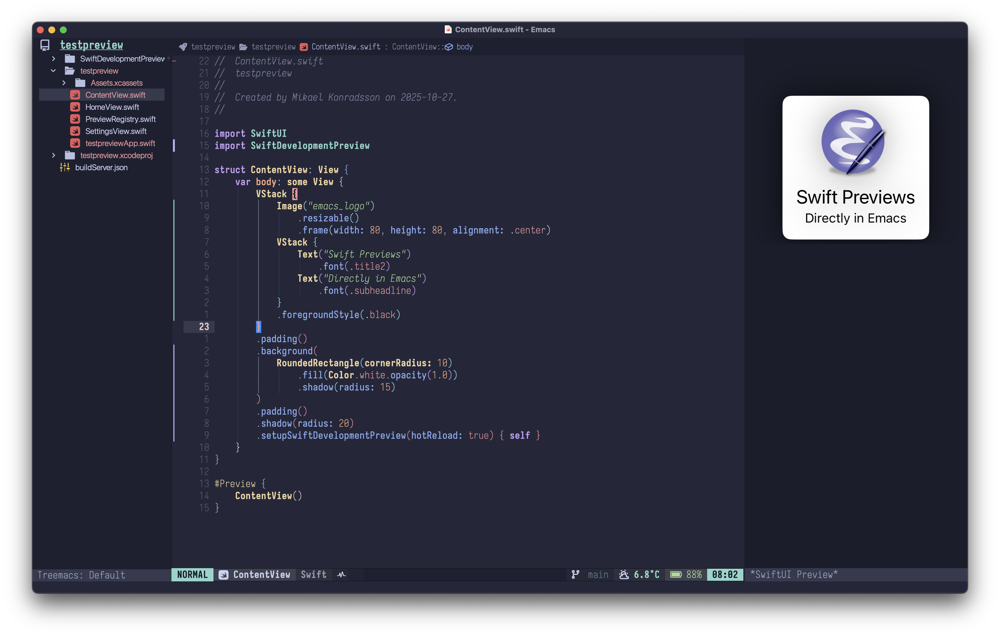
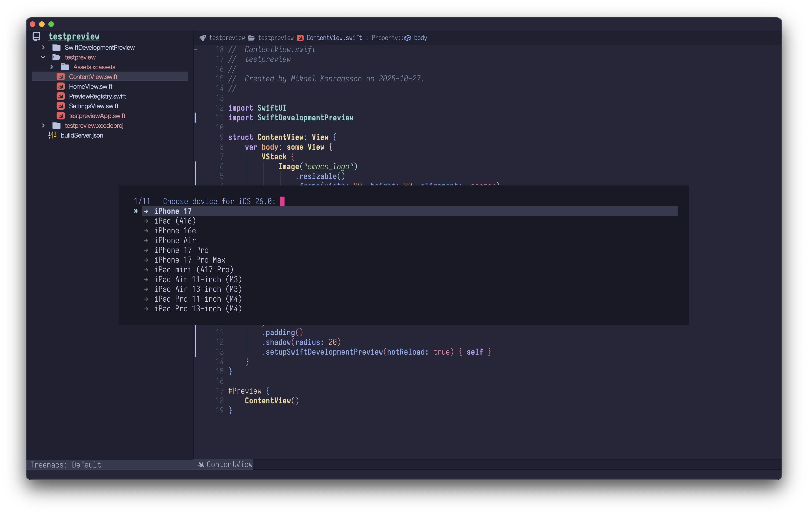
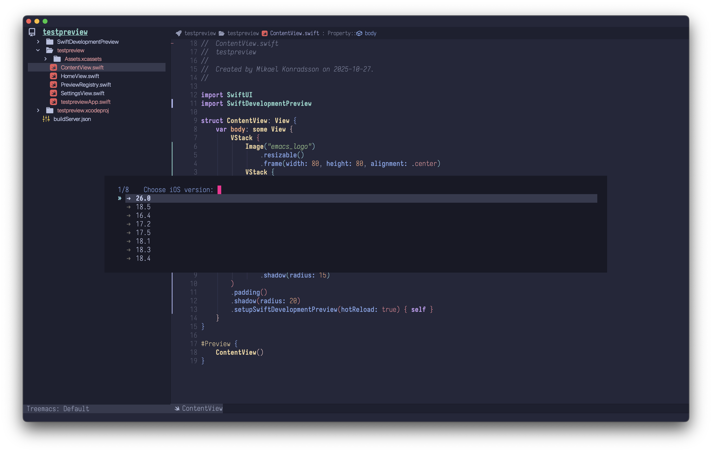
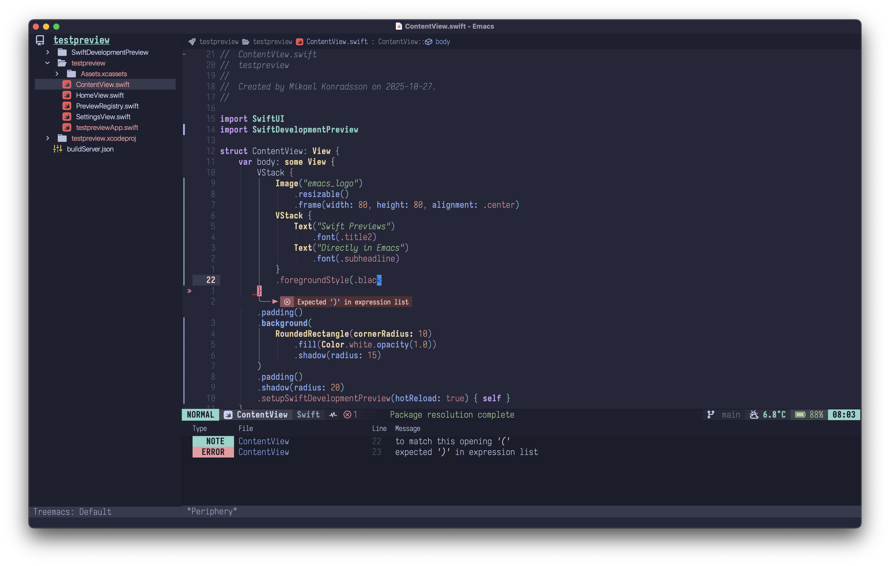
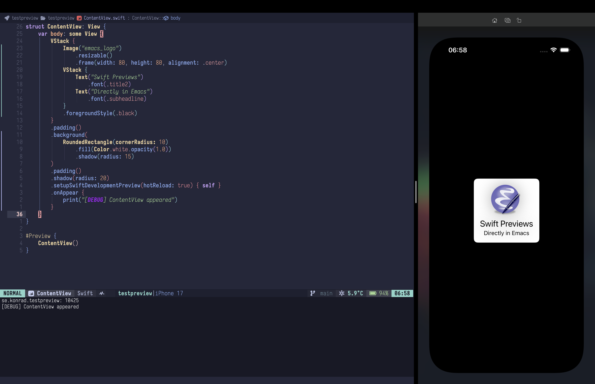

# swift-development - emacs

A comprehensive Emacs package for iOS and macOS development with Swift and Xcode.

<picture>
    
</picture>

## Sponsoring

❤️ [Please sponsor me if you like this package](https://github.com/sponsors/konrad1977)

## Dependencies

> **Note:** This package is designed for **macOS only** as it requires Xcode and iOS Simulator.

### Required System Tools

These must be installed on your system:

- **macOS** - This package requires macOS as it integrates with Xcode and iOS Simulator
- **Xcode** - Full Xcode installation (not just Command Line Tools) is required for iOS development
- **Xcode Command Line Tools** - Required for command-line Swift compilation
  ```bash
  xcode-select --install
  ```

- **[xcode-build-server](https://github.com/SolaWing/xcode-build-server)** - Build Server Protocol for LSP integration
  ```bash
  brew install xcode-build-server
  ```

### Required Emacs Packages

Built-in packages (no installation needed):

- `project` - Built-in project management
- `json` - Built-in JSON support
- `compile` - Built-in compilation mode
- `cl-lib` - Built-in Common Lisp extensions

### Recommended Emacs Packages

For the best Swift editing experience:

- **[swift-ts-mode](https://codeberg.org/woolsweater/swift-ts-mode)** - Tree-sitter based Swift major mode (recommended)
  - Superior syntax highlighting and code navigation
  - Requires Emacs 29+ with tree-sitter support
  - Alternative: [swift-mode](https://github.com/swift-emacs/swift-mode) (traditional mode, install via MELPA)

- **[periphery](https://github.com/konrad1977/periphery)** - Enhanced error parsing and navigation for Swift
  - Beautiful error display and navigation
  - Automatic error highlighting and quickfix

### Optional Emacs Packages

These add extra features:

- **[dape](https://github.com/svaante/dape)** - Debug Adapter Protocol support for Emacs
  - Enables interactive debugging with breakpoints
  - Install via MELPA: `M-x package-install RET dape RET`

- **[request](https://github.com/tkf/emacs-request)** - HTTP request library
  - Required for Hacking with Swift integration
  - Install via MELPA: `M-x package-install RET request RET`

- **[mode-line-hud](https://github.com/konrad1977/punch-line/blob/master/mode-line-hud.el)** - Visual notifications in mode-line
  - Provides elegant build progress indicators
  - Install via Github

- **[knockknock](https://github.com/konrad1977/knockknock)** - Visual notifications
  - Provides elegant progress indicators in a posframe
  - Install via GitHub

- **[nerd-icons](https://github.com/rainstormstudio/nerd-icons.el)** - Icon support
  - Prettier UI elements
  - Install via MELPA: `M-x package-install RET nerd-icons RET`

- **[eglot](https://github.com/joaotavora/eglot)** - LSP client (built-in with Emacs 29+)
  - Enhanced Swift language server integration
  - Built-in with Emacs 29+, or install via MELPA for earlier versions

### Optional Debugging Tools

For advanced debugging features:

- **[vscode-lldb](https://marketplace.visualstudio.com/items?itemName=vadimcn.vscode-lldb)** - LLDB debugger adapter
  - Used with `dape` for debugging Swift/iOS apps
  - Install via VS Code marketplace or download from GitHub releases

## Features

### Core Functionality
- **Xcode Integration**: Build, run, and debug iOS apps directly from Emacs
- **Multi-Project Support**: Work on multiple Swift projects simultaneously with buffer-local state
- **Simulator Management**: Control iOS simulators, view logs, and manage devices
- **Auto-Launch Simulator**: Automatically starts simulator when opening a project
- **Multi-Simulator Support**: Run apps on multiple simulators simultaneously
- **Smart Caching**: Automatic build cache warming for faster compilation
- **Ultra-Fast Rebuild Detection**: Last-modified file detection (10-50x faster than hash-based)
- **Persistent Settings**: Project settings survive Emacs restarts
- **Unified Mode Support**: Works seamlessly with both swift-mode and swift-ts-mode
- **LSP Support**: Enhanced Swift language server integration
- **Project Management**: Automatic scheme detection and project configuration
- **Error Handling**: Advanced error parsing and navigation
- **Flexible Notifications**: Choose between mode-line-hud, minibuffer, or custom notifications

### Developer Tools
- **SwiftUI Preview**: Generate and display SwiftUI view previews in Emacs
- **Build Optimization**: Turbo mode, balanced mode, and comprehensive build system optimization
- **Simulator Testing**: Push notifications, language switching, and localization testing
- **Xcode Tools**: Accessibility Inspector, Instruments profiling, and developer utilities
- **Error Handling**: Comprehensive diagnostics, error logging, and environment validation
- **Refactoring**: Code refactoring utilities for Swift
- **Documentation**: Query Apple Developer Documentation and Hacking with Swift
- **Localization**: Major mode for editing `.strings` files
- **Device Management**: Deploy and debug on physical iOS devices
- **Advanced Features**: Memory leak detection, code coverage, dependency analysis

## Screenshots

### SwiftUI Preview
Real-time SwiftUI view previews directly in Emacs with automatic generation and hot reload support.



### Simulator Selection
Choose from available iOS simulators with easy device selection.



### iOS Version Selection
Select specific iOS versions and device configurations.



### Periphery Integration
Built-in error detection and navigation with Periphery integration.



### iOS Simulator Console
Real-time simulator logs and debugging output directly in Emacs.



## Installation

### Prerequisites

- Emacs 27.1 or higher
- See the [Dependencies](#dependencies) section above for required system tools and packages

### Setup

1. Clone or download this repository to your Emacs load path:

```bash
git clone <repository-url> ~/.emacs.d/localpackages/swift
```

2. Add to your init.el:

```elisp
(add-to-list 'load-path "~/.emacs.d/localpackages/swift")

;; Load the main package
(require 'swift-development)
(require 'xcode-project)
(require 'xcode-build-config)

;; Optional modules
(require 'ios-simulator)
(require 'ios-device)
(require 'swift-refactor)
(require 'localizeable-mode)
```

## File Structure

```
swift/
├── README.md                      # This file
├── swift-development.el           # Main Swift development utilities
├── xcode-project.el               # Xcode project management
├── swift-project-settings.el      # Persistent project settings
├── xcode-build-config.el          # Build configuration and flags
├── swift-cache.el                 # Unified caching system
├── swift-project.el               # Project utilities
├── swift-features.el              # Additional Swift features
├── swift-error-handler.el         # Error parsing and handling
├── swift-lsp.el                   # LSP integration
├── swiftui-preview.el             # SwiftUI preview support
├── swift-refactor.el              # Refactoring tools
├── xcode-build.el                 # Build system
├── xcodebuildserver.el            # Build server configuration
├── ios-simulator.el               # iOS Simulator integration
├── ios-device.el                  # Physical device management
├── localizeable-mode.el           # Localization file editing
├── apple-docs-query.el            # Apple documentation lookup
├── hacking-with-swift.el          # Hacking with Swift integration
└── templates/
    └── SwiftDevelopmentPreview/   # Swift package for preview support
```

## Module Overview

### swift-development.el
Main entry point with build orchestration, app running, and cache warming.

**Key functions:**
- `swift-development-compile-app` - Build the current project
- `swift-development-run-app` - Run app in simulator
- `swift-development-warm-build-cache` - Precompile system frameworks
- `swift-development-toggle-analysis-mode` - Adjust compilation performance

### xcode-project.el
Xcode project and scheme management, build folders, and debugging. Uses buffer-local variables for multi-project support.

**Key functions:**
- `xcode-project-show-project-info` - Display current buffer's project information (scheme, config, etc.)
- `xcode-project-reset` - Reset project configuration
- `xcode-project-clean-build-folder` - Clean build artifacts
- `xcode-project-cache-diagnostics` - View cache status
- `xcode-project-toggle-device-choice` - Switch between simulator/device
- `xcode-project-start-debugging` - Launch debugger (requires dape)

### swift-project-settings.el
Persistent project settings that survive Emacs restarts. Settings are stored per-project and automatically loaded into buffer-local variables when you open a Swift file, enabling seamless multi-project workflows.

**Key functions:**
- `swift-project-settings-save` - Save project settings to disk
- `swift-project-settings-load` - Load settings from previous session
- `swift-project-settings-show-diagnostics` - View current project settings
- `swift-project-settings-clear` - Clear saved settings
- `swift-project-settings-clear-all-cache` - Clear all cache files
- `ios-simulator-choose-simulator` - Select and save simulator choice

**What it saves:**
- Selected scheme and build configuration
- Simulator selection (device name and ID)
- Device platform (simulator or physical device)
- App identifier and build folder
- Last modified file (for ultra-fast rebuild detection)
- Build configuration (Debug, Release, etc.)
- Last updated timestamp

**Storage location:**
Settings are stored in `.swift-development/` directory in your project root:
- `.swift-development/settings` - Project configuration (~500 bytes)
- `.swift-development/device-cache` - Cached simulator devices (optional, created on simulator selection)

**Auto-launch simulator:**
When `swift-development-auto-launch-simulator` is `t` (default), the simulator automatically starts when you open a project with saved settings. Disable with:
```elisp
(setq swift-development-auto-launch-simulator nil)
```

### xcode-build-config.el
Build configuration, command construction, and optimization flags.

**Key functions:**
- `xcode-build-config-build-app-command` - Generate xcodebuild command
- `xcode-build-config-setup-build-environment` - Configure environment vars
- `xcode-build-config-generate-fast-build-xcconfig` - Create optimized xcconfig

**Key variables:**
- `xcode-build-config-other-swift-flags` - Custom Swift compiler flags
- `xcode-build-config-default-configuration` - Default build configuration
- `xcode-build-config-skip-package-resolution` - Package resolution strategy
- `xcode-build-config-parallel-jobs-multiplier` - CPU cores multiplier for parallel jobs (default: 2)
- `xcode-build-config-link-jobs-divisor` - Divisor for link jobs to reduce memory usage (default: 2)
- `xcode-build-config-swift-exec-memlimit` - Memory limit in MB for Swift compiler (default: 8192)
- `xcode-build-config-xcode-cache-dir` - Xcode DerivedData cache directory
- `xcode-build-config-swift-cache-dir` - Swift Package Manager cache directory
- `xcode-build-config-package-cache-path` - Swift package cache path
- `xcode-build-config-cloned-sources-path` - Cloned Swift package sources path

### swift-cache.el
High-performance caching system for expensive operations.

**Key functions:**
- `swift-cache-clear` - Clear all cached data
- `swift-cache-stats` - Display cache statistics
- `swift-cache-invalidate-project` - Invalidate project-specific cache

### swift-lsp.el
Language Server Protocol (LSP) integration for Swift with proper iOS simulator support.

**Key functions:**
- `swift-lsp-eglot-server-contact` - Configure eglot for Swift development with UIKit/SwiftUI support
- `ios-simulator-target` - Get the current simulator SDK target triple
- `lsp-arguments` - Generate LSP arguments with proper SDK and target configuration

**Setup with eglot:**
```elisp
(require 'swift-lsp)
(require 'eglot)

;; Configure eglot for Swift
(add-to-list 'eglot-server-programs
             '(swift-ts-mode . swift-lsp-eglot-server-contact))
```

The LSP configuration automatically:
- Locates `sourcekit-lsp` via `xcrun`
- Configures the iOS simulator SDK path
- Sets up the correct target triple (e.g., `arm64-apple-ios17.0-simulator`)
- Adds necessary compiler flags for UIKit/SwiftUI development

### swiftui-preview.el
**Fully automatic SwiftUI preview generation and display within Emacs** - with intelligent view routing, automatic #Preview macro support, and zero-config setup.

#### What's New (2025-10-30)

- ✅ **Zero-Config Setup**: Auto-installs SwiftDevelopmentPreview package and creates PreviewRegistry.swift
- ✅ **#Preview Macro Support**: Write standard Xcode #Preview macros, compatible with Xcode
- ✅ **File-Based Naming**: Previews named after Swift files (HomeView.swift → HomeView.png)
- ✅ **Auto-Show**: Previews appear automatically when opening Swift files
- ✅ **Auto-Update**: Saves trigger automatic preview regeneration
- ✅ **Smart Caching**: Only rebuilds when source files change

#### Quick Start

1. **First-time setup** (automatic):
   - Open any Swift file in your project
   - Run `M-x swiftui-preview-generate` or press `C-c C-p`
   - SwiftDevelopmentPreview package is installed automatically
   - PreviewRegistry.swift is created automatically
   - That's it! No manual setup required.

2. **Update your App file** to use PreviewRoot (one-time):
   ```swift
   import SwiftUI
   import SwiftDevelopmentPreview

   @main
   struct YourApp: App {
       init() {
           registerAllViewsForPreview()
       }

       var body: some Scene {
           WindowGroup {
               PreviewRoot {
                   ContentView()  // Your normal root view
               }
           }
       }
   }
   ```

3. **Write views with #Preview macros** (Xcode-compatible):
   ```swift
   import SwiftUI
   import SwiftDevelopmentPreview

   struct ContentView: View {
       var body: some View {
           VStack {
               Text("Hello, World!")
               Button("Tap me") { }
           }
       }
   }

   #Preview("Light Mode") {
       ContentView()
   }

   #Preview("Dark Mode") {
       ContentView()
           .preferredColorScheme(.dark)
   }
   ```

4. **Generate preview**:
   - Press `C-c C-p` or run `M-x swiftui-preview-generate`
   - Preview appears automatically!

#### How It Works

The preview system uses **intelligent dynamic routing** to show the correct view:

1. **Automatic View Registration**: When you run preview, `PreviewRegistry.swift` is automatically updated to register only the current view
2. **Dynamic Routing**: `PreviewRoot` detects preview mode and shows the requested view instead of the normal root view
3. **File-Based Naming**: Each view gets its own preview file (e.g., `HomeView.swift` → `HomeView.png`)
4. **Zero Manual Configuration**: No manual registration lists to maintain!

**Example Flow:**
```
1. Open HomeView.swift → Run C-c C-p
   → PreviewRegistry.swift updated: register("HomeView")
   → Build (fast! only PreviewRegistry.swift changed)
   → App launches showing HomeView
   → HomeView.png created and displayed

2. Switch to SettingsView.swift → Run C-c C-p
   → PreviewRegistry.swift updated: register("SettingsView")
   → Build (fast!)
   → App launches showing SettingsView
   → SettingsView.png created and displayed
```

#### Multiple Preview Support 🎨

**NEW:** Write standard #Preview macros - Emacs handles the rest automatically!

SwiftUI preview now has **intelligent support for Xcode's #Preview macros**. Write the same code as in Xcode, and Emacs automatically generates executable wrapper views in the background.

**How it works:**

You write standard Xcode-compatible code:
```swift
import SwiftUI
import SwiftDevelopmentPreview

struct HomeView: View {
    var body: some View {
        VStack {
            Text("Hello, World!")
        }
        .padding()
    }
}

#Preview("Light Mode") {
    HomeView()
}

#Preview("Dark Mode") {
    HomeView()
        .preferredColorScheme(.dark)
}

#Preview("Large Text") {
    HomeView()
        .dynamicTypeSize(.xxxLarge)
}
```

**When you run `C-c C-p`, this happens automatically:**

1. **Parses #Preview macros** - Emacs reads and extracts all #Preview definitions
2. **Generates wrapper views** - Automatically creates executable structs in `HomeView.PreviewWrappers.swift` (same directory as HomeView.swift):
```swift
struct HomeView_Preview_1: View {
    var body: some View {
        HomeView()
            .setupSwiftDevelopmentPreview() { self }
    }
}

struct HomeView_Preview_2: View {
    var body: some View {
        HomeView()
            .preferredColorScheme(.dark)
            .setupSwiftDevelopmentPreview() { self }
    }
}

struct HomeView_Preview_3: View {
    var body: some View {
        HomeView()
            .dynamicTypeSize(.xxxLarge)
            .setupSwiftDevelopmentPreview() { self }
    }
}
```

3. **Registers in PreviewRegistry** - All wrapper views are registered automatically
4. **Builds and generates** - Creates preview images for your views

**Benefits:**

✅ **Xcode-compatible syntax** - Same #Preview code works in both Xcode and Emacs
✅ **No extra code** - No manual wrapper views or registrations
✅ **Automatic generation** - Wrapper files are created and cleaned automatically
✅ **Clean** - Wrapper files with `.PreviewWrappers.swift` suffix (easy to gitignore)

**Files created:**
```
testpreview/
├── HomeView.swift                    # Your original code with #Preview
├── HomeView.PreviewWrappers.swift   # Auto-generated (gitignore this!)
└── .swift-development/
    └── swiftuipreview/
        └── HomeView.png             # Generated preview image
```

**Gitignore:**
Add to your `.gitignore`:
```
# SwiftUI Preview auto-generated wrapper files
*.PreviewWrappers.swift
```

**Configuration:**
```elisp
;; Enable multiple preview support (default: t)
(setq swiftui-preview-multiple-previews-enabled t)

;; Configure which preview types to detect
(setq swiftui-preview-detect-setup-modifier t)     ; .setupSwiftDevelopmentPreview()
(setq swiftui-preview-detect-preview-macro t)      ; #Preview macros
(setq swiftui-preview-detect-preview-provider t)   ; PreviewProvider protocol
```

**Example with #Preview macros:**
```swift
import SwiftUI
import SwiftDevelopmentPreview

#Preview("Default") {
    ContentView()
}

#Preview("Dark Mode") {
    ContentView()
        .preferredColorScheme(.dark)
}

#Preview("Large Text") {
    ContentView()
        .dynamicTypeSize(.xxxLarge)
}

// Press C-c C-p in Emacs to generate preview
```

#### Automatic Features

**✅ Auto-Show Existing Previews** (enabled by default)
When you open a Swift file, if a preview image exists, it's automatically displayed:
```elisp
(setq swiftui-preview-auto-show-on-open t)  ; Default: enabled
```

**✅ Auto-Generate Missing Previews** (opt-in)
Automatically generate preview when opening a file without one:
```elisp
;; Enable auto-generation
(setq swiftui-preview-auto-generate-on-open t)

;; Or use commands
M-x swiftui-preview-enable-auto-generate
M-x swiftui-preview-disable-auto-generate
```

With auto-generate enabled:
- Open `SettingsView.swift` (no preview exists yet)
- Wait 1 second → Automatically builds and generates `SettingsView.png`
- Preview appears automatically!

**✅ Auto-Switch Between Views**
Switch buffers and previews automatically update:
- Buffer showing `HomeView.swift` → Shows `HomeView.png`
- Switch to `ContentView.swift` → Automatically shows `ContentView.png`

**✅ Auto-Update On Save**
When preview is visible and you save a Swift file, preview automatically regenerates:
```elisp
(setq swiftui-preview-auto-update-on-save t)  ; Default: enabled

;; Disable for slower machines
(setq swiftui-preview-auto-update-on-save nil)
```

#### Key Commands

**Basic Commands:**
- `C-c C-p` / `M-x swiftui-preview-generate` - Generate preview for current view (auto-generates wrappers from #Preview)
- `M-x swiftui-preview-show-existing` - Show existing preview without regenerating
- `M-x swiftui-preview-refresh` - Refresh currently displayed preview
- `M-x swiftui-preview-clear` - Clear all preview images and temporary wrapper files
- `M-x swiftui-preview-clean-temp-files` - Clean only auto-generated wrapper files
- `M-x swiftui-preview-show-directory` - Open preview directory in Dired
- `g` (in preview buffer) - Regenerate current preview

**Configuration Commands:**
- `M-x swiftui-preview-enable-auto-show` - Enable auto-show on file open
- `M-x swiftui-preview-disable-auto-show` - Disable auto-show
- `M-x swiftui-preview-enable-auto-generate` - Enable auto-generation
- `M-x swiftui-preview-disable-auto-generate` - Disable auto-generation
- `M-x swiftui-preview-enable-auto-update` - Enable auto-update on save
- `M-x swiftui-preview-disable-auto-update` - Disable auto-update
- `M-x swiftui-preview-toggle-debug` - Toggle debug messages

#### Preview Storage

Previews are saved in `.swift-development/swiftuipreview/` with file-based naming:
```
.swift-development/
├── settings              # Project settings
├── device-cache          # Simulator cache
└── swiftuipreview/       # Preview images
    ├── ContentView.png
    ├── HomeView.png
    └── SettingsView.png
```

#### Configuration

```elisp
;; Auto-show existing previews when opening files (default: t)
(setq swiftui-preview-auto-show-on-open t)

;; Auto-generate missing previews (default: nil, can be slow)
(setq swiftui-preview-auto-generate-on-open nil)

;; Auto-update preview when saving files (default: t)
(setq swiftui-preview-auto-update-on-save t)

;; Use file-based naming (HomeView.swift → HomeView.png)
(setq swiftui-preview-use-file-based-naming t)

;; Multiple preview support (default: t)
(setq swiftui-preview-multiple-previews-enabled t)

;; Preview detection configuration (all default: t)
(setq swiftui-preview-detect-setup-modifier t)    ; Detect .setupSwiftDevelopmentPreview()
(setq swiftui-preview-detect-preview-macro t)     ; Detect #Preview macros
(setq swiftui-preview-detect-preview-provider t)  ; Detect PreviewProvider

;; Preview generation settings
(setq swiftui-preview-poll-interval 0.5)          ; Check for preview every 0.5s
(setq swiftui-preview-timeout 30)                 ; Wait up to 30 seconds
(setq swiftui-preview-window-width 0.25)          ; Preview window width (fraction)
(setq swiftui-preview-debug nil)                  ; Enable debug messages

;; Hide compilation buffer on successful builds
(setq swiftui-preview-hide-compilation-on-success t)
```

#### Complete Workflow Example

**Adding a new view:**
```swift
// 1. Create SettingsView.swift with #Preview
import SwiftUI
import SwiftDevelopmentPreview

struct SettingsView: View {
    var body: some View {
        Form {
            Section("Account") {
                Text("Username")
            }
        }
    }
}

#Preview {
    SettingsView()
}

// 2. Open file in Emacs → C-c C-p
//    → PreviewRegistry.swift auto-updated
//    → Build (fast!)
//    → SettingsView.png created and displayed

// 3. Make changes → Save (C-x C-s)
//    → Preview auto-updates!

// 4. Switch to HomeView.swift
//    → Preview automatically switches to HomeView.png
```

**No manual steps needed:**
- ✅ No editing PreviewRegistry.swift
- ✅ No updating App file
- ✅ No manual view registration
- ✅ It just works!

#### Troubleshooting

**Preview times out:**
- Check that `.setupSwiftDevelopmentPreview()` is added to your view
- Verify `PreviewRoot` is configured in your App file
- Enable debug: `(setq swiftui-preview-debug t)`
- Check `*compilation*` buffer for build errors

**Preview shows wrong view:**
- Check that view struct name matches filename (e.g., `struct HomeView` in `HomeView.swift`)
- Try `M-x swiftui-preview-generate` to force regeneration
- Check debug messages for view name matching

**Build is slow:**
- Disable auto-update on save: `(setq swiftui-preview-auto-update-on-save nil)`
- Check that only PreviewRegistry.swift is being rebuilt (should be very fast)
- Smart rebuild detection skips rebuilds when no source files changed

**Auto-features not working:**
- Verify hooks are loaded: `M-x describe-variable swift-mode-hook`
- Check if auto-show is enabled: `M-x describe-variable swiftui-preview-auto-show-on-open`
- Try manual commands first: `M-x swiftui-preview-show-existing`

**Common issues:**
- Preview requires iOS Simulator (macOS only)
- Auto-generate can trigger builds automatically (disable on slow machines)
- Ensure `PreviewRoot` wraps your root view in App file
- Make sure #Preview macro or .setupSwiftDevelopmentPreview() is present in your view

### xcodebuildserver.el
Automatic Build Server Protocol (BSP) configuration for LSP integration.

**Key functions:**
- `xcodebuildserver-check-configuration` - Verify and generate BSP configuration
- `xcodebuildserver-does-configuration-file-exist` - Check for existing `buildServer.json`

**What it does:**
The package automatically configures the Build Server Protocol for your Xcode project by generating a `buildServer.json` file. This enables advanced LSP features like:
- Accurate code completion for your project's dependencies
- Jump to definition across Swift Package dependencies
- Proper symbol resolution for CocoaPods and Carthage dependencies

**Requirements:**
Install `xcode-build-server` via Homebrew:
```bash
brew install xcode-build-server
```

**Integration:**
The package automatically runs `xcode-build-server config` when you open a project, creating the necessary configuration file. After building your project, the build output is parsed and fed to `xcode-build-server parse` to keep the LSP server synchronized with your build state.

### ios-simulator.el
iOS Simulator control and log viewing with syntax-highlighted console output.

**Key functions:**
- `ios-simulator:run` - Launch app in simulator
- `ios-simulator:view-logs` - View simulator logs
- `ios-simulator:reset` - Reset simulator state

#### Colorized Console Output

The simulator output buffer features syntax highlighting for easier log analysis:

**Error Detection (Red):**
- Objective-C runtime errors: `*** -[NSMutableArray addObjectsFromArray:]: array argument is not an NSArray`
- NSError/Cocoa errors: `Error Domain=NSCocoaErrorDomain Code=4`, `NSUnderlyingError`, `NSPOSIXErrorDomain`
- ThreadSanitizer/AddressSanitizer: `WARNING: ThreadSanitizer: race on NSMutableArray`
- Fatal signals: `DEADLYSIGNAL`, `SEGV`, `SIGABRT`
- Generic errors: Lines containing `ERROR:` or `ERROR -`
- HTTP error codes: `404`, `500`, `503` (4xx/5xx status codes)

**Warning Detection (Yellow):**
- Warning messages: Lines containing `WARNING:` or `WARNING -`
- Log levels: `[lvl=3]` and similar patterns

**Informational:**
- Timestamps: `2025-12-05 10:58:48.588` (dimmed)
- Categories: `[Intercom]`, `[CoreData]`, `[SegmentedControl]` (highlighted)
- URLs: `https://api.example.com/endpoint` (link style, clickable)
- File paths: `/Users/.../Documents/file.txt`, `NSFilePath=...`, `NSURL=file://...` (underlined)
- HTTP success codes: `200`, `201` (green)
- Version numbers: `9.2.0.0`, `10.6.0.0`
- Update notices: `New version of Google Maps SDK available: 10.6.0.0`

**Stack Traces:**
- Frame numbers: `#0`, `#1`, `#2` (highlighted)
- Memory addresses: `0x16b617000` (string color)
- Thread identifiers: `Thread T123`, `tid=117645`

**Configuration:**
```elisp
;; Disable colorized output (default: t)
(setq ios-simulator-colorize-output nil)
```

**Customizable Faces:**
- `ios-simulator-error-face` - Errors (inherits from `error`)
- `ios-simulator-warning-face` - Warnings (inherits from `warning`)
- `ios-simulator-debug-face` - Debug messages
- `ios-simulator-info-face` - Info/categories
- `ios-simulator-url-face` - URLs (inherits from `link`)
- `ios-simulator-filepath-face` - File paths (underlined string color)
- `ios-simulator-http-error-face` - HTTP 4xx/5xx codes
- `ios-simulator-http-success-face` - HTTP 2xx codes
- `ios-simulator-objc-error-face` - ObjC runtime errors
- `ios-simulator-version-face` - Version numbers
- `ios-simulator-thread-face` - Thread identifiers
- `ios-simulator-address-face` - Memory addresses
- `ios-simulator-stackframe-face` - Stack frame numbers

### ios-device.el
Physical device deployment and debugging.

**Key functions:**
- `ios-device:choose-device` - Select a connected device
- `ios-device:reset-privacy` - Reset app privacy settings on device

### swift-refactor.el
Code refactoring utilities.

**Key functions:**
- `swift-refactor:extract-function` - Extract code to new function
- `swift-refactor:rename-symbol` - Rename symbols across project

### localizeable-mode.el
Major mode for editing .strings localization files with syntax highlighting.

### apple-docs-query.el / hacking-with-swift.el
Quick documentation lookup from Emacs.

**Key functions:**
- `apple-docs/query` - Search Apple Developer Documentation
- `hacking-ws/query` - Search Hacking with Swift tutorials

## Build Performance & Optimization

The package includes several commands to optimize build performance for different scenarios.

### Turbo Mode

**`swift-development-enable-turbo-mode`** - Enable maximum build speed optimizations

Turbo mode configures the build system for fastest possible incremental builds by:

**What it does:**
- **Disables Whole Module Optimization** (`-no-whole-module-optimization`)
  - Compiles each file independently instead of analyzing the entire module
  - Dramatically faster incremental builds when changing a single file
  - Trade-off: Slightly larger binary size and potentially slower runtime

- **Disables Thin LTO** (Link Time Optimization)
  - LTO can slow down incremental builds due to cross-module analysis
  - Better for development where build speed > binary optimization

- **Enables Build Timing Summary**
  - Shows detailed timing for each compilation phase
  - Helps identify bottlenecks in your build

- **Resets Build Cache**
  - Clears cached build commands to ensure new settings take effect

**When to use:**
- During active development with frequent code changes
- When incremental build time is critical
- When you don't need runtime performance optimization

```elisp
M-x swift-development-enable-turbo-mode
```

### Balanced Mode

**`swift-development-enable-balanced-mode`** - Balanced build speed with debugging capability

Similar to Turbo Mode but maintains better debugging experience. Currently uses the same optimizations as Turbo Mode.

```elisp
M-x swift-development-enable-balanced-mode
```

### Build System Optimization

**`swift-development-optimize-build-system`** - Comprehensive build system optimization

Performs multiple optimizations to speed up the build system:

**What it does:**
1. **Clears Module Cache**
   - Removes `~/Library/Developer/Xcode/DerivedData/ModuleCache`
   - Forces fresh compilation of system frameworks

2. **Stops SPM Daemons**
   - Kills any stuck `swift-package` processes
   - Prevents conflicts with package resolution

3. **RAM Disk Detection**
   - Automatically uses `/Volumes/RAMDisk` for DerivedData if available
   - Dramatically faster I/O operations

4. **Generates Optimized xcconfig**
   - Creates `/tmp/fast-build.xcconfig` with optimized settings:
     - **Optimization:** `-Osize` for Swift, incremental compilation mode
     - **Caching:** Enables Swift dependency cache, compile job cache, precompiled headers
     - **Parallelization:** Uses all CPU cores for parallel module/compile jobs
     - **Architecture:** arm64 only, excludes i386/x86_64 for faster builds
     - **Disabled features:** Index store, bitcode, sanitizers, testability, previews
     - **Warnings:** Suppressed to reduce noise and compiler overhead

5. **Cleans SPM Cache**
   - Removes `~/.swiftpm/cache` for fresh package state

```elisp
M-x swift-development-optimize-build-system
```

### Incremental Build Optimization

**`swift-development-optimize-for-incremental-builds`** - Configure for fastest incremental builds

Optimizes specifically for incremental compilation scenarios:

**What it does:**
- Smart package resolution (auto mode)
- Fast analysis mode
- No Thin LTO
- Removes extra Swift compiler flags for maximum compatibility

```elisp
M-x swift-development-optimize-for-incremental-builds
```

### Build Benchmarking

**`swift-development-benchmark-build`** - Measure build performance

Runs a build with detailed timing information to identify performance bottlenecks.

```elisp
M-x swift-development-benchmark-build
```

### Dependency Management

**`swift-development-fix-dependency-issues`** - Fix CocoaPods and SPM issues

Automatically detects and fixes common dependency problems in hybrid projects:

**For CocoaPods:**
- Cleans CocoaPods cache (`pod cache clean --all`)
- Removes and reinstalls Pods directory
- Updates pod dependencies (`pod install --repo-update`)

**For Swift Package Manager:**
- Removes `Package.resolved` to force re-resolution
- Cleans `~/.swiftpm/cache`
- Cleans `.build` directory
- Runs `xcodebuild -resolvePackageDependencies`

**Always:**
- Cleans DerivedData for the current project
- Generates optimized xcconfig file

```elisp
M-x swift-development-fix-dependency-issues
```

### Running Without Rebuilding

**`swift-development-run`** - Run already-built app without recompiling

Much faster than `swift-development-run-app` when you know the app is already built.

```elisp
M-x swift-development-run
```

### Deep Cleaning

**`xcode-project-deep-clean`** - Nuclear option for build issues

Performs the most thorough cleanup:
- Removes `.build` folder
- Cleans ALL Swift package caches
- Deletes entire `~/Library/Developer/Xcode/DerivedData` directory

Use when you have stubborn build errors that won't resolve.

```elisp
M-x xcode-project-deep-clean
```

**`swift-development-clear-derived-data`** - Clear DerivedData only

Lighter alternative that only clears Xcode's DerivedData folder.

```elisp
M-x swift-development-clear-derived-data
```

## Simulator Testing Features

### Push Notifications

**`ios-simulator-send-notification`** - Send push notifications to simulator

Test your app's notification handling without a real device or APNs server.

**What it does:**
- Prompts for notification text
- Creates APS-formatted JSON payload: `{"aps":{"alert":"text","sound":"default"}}`
- Uses `xcrun simctl push` to deliver notification to running app
- Automatically cleans up temporary JSON file

**Requirements:**
- Simulator must be booted
- App must be running
- App identifier must be configured

```elisp
M-x ios-simulator-send-notification
```

### Localization Testing

**`ios-simulator-change-language`** - Change simulator language

Quickly test your app's localization by changing the simulator's language setting.

**What it does:**
- Shows interactive menu of available languages
- Reconfigures simulator language
- Relaunches app with new language setting

**Use for:**
- Testing RTL (Right-to-Left) languages
- Verifying string translations
- Testing date/number formatting
- Checking layout with different text lengths

```elisp
M-x ios-simulator-change-language
```

### Simulator Utilities

**`ios-simulator-toggle-buffer`** - Show/hide simulator output buffer

Toggle visibility of the buffer showing simulator console output.

```elisp
M-x ios-simulator-toggle-buffer
```

**`ios-simulator-appcontainer`** - Open app's container directory

Opens Finder to your app's data container in the simulator. Useful for:
- Inspecting saved files
- Viewing Core Data sqlite files
- Checking UserDefaults
- Debugging file system issues

```elisp
M-x ios-simulator-appcontainer
```

## Error Handling & Diagnostics

The package includes comprehensive error handling and diagnostic tools.

### Error Log Management

**`swift-error-handler-show-log`** - Display the error log buffer

Shows all captured build errors and warnings in a dedicated buffer.

```elisp
M-x swift-error-handler-show-log
```

**`swift-error-handler-clear-log`** - Clear the error log

Clears all accumulated error messages.

```elisp
M-x swift-error-handler-clear-log
```

**`swift-error-handler-validate-environment`** - Validate Swift development environment

Checks your environment for common issues:
- Xcode installation
- Command line tools
- Swift toolchain
- Required dependencies

```elisp
M-x swift-error-handler-validate-environment
```

### Build Diagnostics

**`swift-development-show-last-build-errors`** - Show recent build errors

Displays the last 50 lines of build output, filtered for errors and warnings.

```elisp
M-x swift-development-show-last-build-errors
```

**`swift-development-diagnose`** - Show comprehensive diagnostics

Displays detailed information about:
- Current project configuration
- Build settings
- Cache status
- Simulator state
- Package dependencies

```elisp
M-x swift-development-diagnose
```

**`swift-development-diagnose-auto-warm`** - Debug cache warming

Diagnoses why automatic cache warming might not be working.

```elisp
M-x swift-development-diagnose-auto-warm
```

### Error Display Mode

**`swift-development-toggle-periphery-mode`** - Toggle error display format

Switches between periphery mode and standard compilation mode for error display.

```elisp
M-x swift-development-toggle-periphery-mode
```

## Xcode Developer Tools Integration

### Accessibility Inspector

**`xcode-project-accessibility-inspector`** - Launch Accessibility Inspector

Opens Apple's Accessibility Inspector for testing:
- VoiceOver compatibility
- Dynamic Type support
- Color contrast
- Touch target sizes
- Accessibility labels and hints

```elisp
M-x xcode-project-accessibility-inspector
```

### Performance Profiling

**`xcode-project-instruments`** - Launch Instruments

Opens Instruments for profiling your app:
- Time Profiler
- Allocations
- Leaks
- Network
- Energy diagnostics

```elisp
M-x xcode-project-instruments
```

## Advanced Features (swift-features.el)

Additional advanced features for power users.

### SwiftUI Preview (Alternative)

**`swift-features-swiftui-preview-start`** - Start SwiftUI preview (alternative implementation)

Alternative SwiftUI preview system (see main swiftui-preview.el for primary implementation).

```elisp
M-x swift-features-swiftui-preview-start
M-x swift-features-swiftui-preview-stop
```

### Testing with Coverage

**`swift-features-run-tests-with-coverage`** - Run tests with code coverage

Runs your test suite and generates code coverage reports.

```elisp
M-x swift-features-run-tests-with-coverage
```

### Build Profiling

**`swift-features-profile-build`** - Profile build performance

Identifies build bottlenecks and slow compilation units.

```elisp
M-x swift-features-profile-build
```

### Multi-Simulator Testing

**`swift-features-launch-multiple-simulators`** - Launch on multiple simulators

Launch your app on multiple simulators simultaneously.

```elisp
M-x swift-features-launch-multiple-simulators
M-x swift-features-terminate-all-simulators
```

### Memory Leak Detection

**`swift-features-check-memory-leaks`** - Run memory leak detection

Analyzes your running app for memory leaks.

```elisp
M-x swift-features-check-memory-leaks
```

### Documentation Generation

**`swift-features-generate-documentation`** - Generate project documentation

Generates documentation for your Swift project using DocC or similar tools.

```elisp
M-x swift-features-generate-documentation
```

### Dependency Analysis

**`swift-features-analyze-dependencies`** - Analyze and visualize dependencies

Analyzes your project's dependency graph and shows potential issues.

```elisp
M-x swift-features-analyze-dependencies
```

### Quick Actions

**`swift-features-quick-actions`** - Show quick actions menu

Interactive menu of common Swift development actions.

```elisp
M-x swift-features-quick-actions
```

## Usage Examples

### Building and Running

```elisp
;; Build the current project
M-x swift-development:compile-app

;; Run in simulator
M-x swift-development:run-app

;; Build and run in one command
M-x swift-development:build-and-run
```

### Multi-Project Workflow

You can work on multiple Swift projects simultaneously. Each buffer maintains its own project context (scheme, build configuration, simulator selection, etc.) using buffer-local variables.

**Example workflow:**
```elisp
;; Open first project
C-x C-f ~/Projects/AppA/ContentView.swift
C-c C-c  ; Build and run AppA with its saved settings (scheme: "AppA-Debug")

;; Open second project in another buffer
C-x C-f ~/Projects/AppB/MainView.swift
C-c C-c  ; Build and run AppB with its saved settings (scheme: "AppB-Release")

;; Switch back to first project
C-x b ContentView.swift
C-c C-c  ; Still uses AppA's settings - no interference!
```

**Key features:**
- Each project's settings are automatically loaded from `.swift-development/settings`
- Switching between project buffers automatically switches context
- No manual project reset needed when switching
- View current buffer's project info: `M-x xcode-project-show-project-info`

### Cache Management

The package automatically warms the build cache when you open a Swift file in a new project. This precompiles system frameworks (Foundation, UIKit, SwiftUI, etc.) to speed up subsequent builds.

```elisp
;; View cache diagnostics
M-x xcode-project:cache-diagnostics

;; Manually warm cache
M-x swift-development:warm-build-cache

;; Clear all caches
M-x swift-cache-clear
```

### Device and Simulator Management

```elisp
;; Choose simulator (automatically saved to project settings)
M-x ios-simulator-choose-simulator

;; Switch between simulator and device
M-x xcode-project:toggle-device-choice

;; View simulator logs
M-x ios-simulator:view-logs

;; Reset simulator
M-x ios-simulator:reset

;; Invalidate simulator device cache (forces refresh)
M-x ios-simulator-invalidate-cache
```

**Auto-launch feature:**
After selecting a simulator once, it will automatically launch when you reopen the project (if `swift-development-auto-launch-simulator` is `t`, which is the default).

### Documentation Lookup

```elisp
;; Search Apple Docs for symbol at point
M-x apple-docs/query-thing-at-point

;; Search Hacking with Swift
M-x hacking-ws/query
```

## Notification System

The package includes a flexible notification system that can display build progress, errors, and status updates through different backends.

### Notification Backends

```elisp
;; Choose your preferred notification backend
(setq xcode-project-notification-backend 'mode-line-hud)  ; Default: show in mode-line
;; (setq xcode-project-notification-backend 'message)     ; Alternative: use minibuffer messages
;; (setq xcode-project-notification-backend 'custom)      ; Use custom function
```

**Available backends:**
- `mode-line-hud` - Display notifications in the mode-line using mode-line-hud (recommended)
- `message` - Display notifications in the minibuffer
- `custom` - Use a custom notification function (set via `xcode-project-notification-function`)

All notifications automatically force a display update before blocking operations, ensuring you always see status messages before long-running tasks.

### Using knockknock Instead of mode-line-hud

If you prefer to use [knockknock](https://github.com/konrad1977/knockknock) for visual notifications in a posframe instead of the mode-line, here's a complete example:

```elisp
(use-package knockknock
  :ensure nil
  :config
  (setopt knockknock-border-color "black")

  (defun my-xcode-knockknock-notify (&rest args)
    "Custom notification function using knockknock for xcode-project.
Accepts keyword arguments from xcode-project-notify:
  :message - The message to display
  :delay   - Optional delay (ignored for knockknock)
  :seconds - How long to show notification
  :reset   - Whether to reset (ignored for knockknock)
  :face    - Face for styling (ignored for knockknock)"
    (let* ((message-text (plist-get args :message))
           (seconds (or (plist-get args :seconds) 3))
           ;; Choose icon based on message content
           (icon (cond
                  ((string-match-p "\\(success\\|complete\\|passed\\)" message-text)
                   "nf-cod-check")
                  ((string-match-p "\\(error\\|fail\\)" message-text)
                   "nf-cod-error")
                  ((string-match-p "\\(warning\\|warn\\)" message-text)
                   "nf-cod-warning")
                  ((string-match-p "\\(build\\|compil\\)" message-text)
                   "nf-cod-tools")
                  (t "nf-dev-xcode")))
           ;; Try to extract title from message if it contains a colon
           (parts (split-string message-text ": " t))
           (title (if (> (length parts) 1) (car parts) "Swift-development"))
           (msg (if (> (length parts) 1)
                    (string-join (cdr parts) ": ")
                  message-text)))

      (knockknock-notify
       :title title
       :message msg
       :icon icon
       :duration seconds)))

  ;; Configure xcode-project to use custom backend
  (setq xcode-project-notification-backend 'custom)
  (setq xcode-project-notification-function #'my-xcode-knockknock-notify))
```

This configuration:
- Uses knockknock posframes instead of mode-line notifications
- Automatically selects appropriate icons based on message content (success, error, warning, build)
- Extracts titles from messages that contain colons (e.g., "Build: Complete" becomes title "Build" with message "Complete")
- Respects the `:seconds` parameter for notification duration

## Ultra-Fast Rebuild Detection

The package automatically detects when rebuilds are needed using an extremely fast last-modified file detection system (0.1-0.5 seconds for 1000+ files).

### How It Works

Instead of hashing all files, the system uses a single `find` command to locate the most recently modified source file:

1. **Single Command**: One `find | stat | sort | head` command finds the most recently modified file
2. **Timestamp Comparison**: Compares timestamp + filepath with saved value in settings
3. **Ultra-Fast**: 10-50x faster than hash-based detection (0.1-0.5s vs 2-5s)
4. **Persistent**: Saved in `.swift-development/settings`, survives Emacs restarts
5. **Smart Skipping**: Skips rebuild if no watched files changed since last successful build

**What's monitored:**
- Swift, Obj-C, C/C++ source files
- UI resources (Storyboards, XIBs, Asset Catalogs)
- Test files are ignored by default (configurable)

### Configuration

```elisp
;; Customize which files trigger rebuilds
(setq swift-development-watched-extensions
      '("swift" "m" "mm" "h" "c" "cpp" "storyboard" "xib" "xcassets"))

;; Customize ignored paths (tests don't affect app bundle)
(setq swift-development-ignore-paths
      '("*Tests/*" "*/Tests.swift" "*UITests/*"))

;; Example: Ignore additional paths
(setq swift-development-ignore-paths
      '("*Tests/*" "*/Tests.swift" "*UITests/*" "*Pods/*" "*Generated/*"))
```

### Force Rebuild

Sometimes you need to rebuild regardless of file changes:

```elisp
;; Force rebuild next time
M-x swift-development-reset-build-status

;; Clear all cache files (includes last-modified data)
M-x swift-development-clear-hash-cache

;; Full project reset (clears all settings and caches)
M-x xcode-project-reset
```

### Performance Comparison

```
Old System (hash-based):
- Scan ~1056 files
- Start 1056 async MD5 processes
- Wait for callbacks
- Time: 2-5 seconds

New System (last-modified):
- One find command
- Compare timestamp + path
- Time: 0.1-0.5 seconds

Result: 10-50x faster! 🚀
```

## Multi-Simulator Support

Run your app on multiple simulators simultaneously for testing across different devices/iOS versions.

### Setup Target Simulators

```elisp
;; Add simulators to target list
M-x ios-simulator-add-target-simulator

;; List all target simulators
M-x ios-simulator-list-target-simulators

;; Remove a simulator from targets
M-x ios-simulator-remove-target-simulator

;; Clear all targets (back to single simulator mode)
M-x ios-simulator-clear-target-simulators
```

### Running on Multiple Simulators

Once configured, `M-x swift-development:run-app` will automatically launch your app on all target simulators.

### Ad-hoc Multi-Simulator Testing

```elisp
;; Run on an additional simulator without changing targets
M-x ios-simulator-run-on-additional-simulator

;; List all active simulators with running apps
M-x ios-simulator-list-active-simulators

;; Terminate app on specific simulator
M-x ios-simulator-terminate-app-on-simulator

;; Shutdown a specific simulator
M-x ios-simulator-shutdown-simulator
```

## Configuration

### Swift Mode Support

The package fully supports both `swift-mode` and `swift-ts-mode` (tree-sitter). Auto-warming, working directory setup, and all hooks work identically with both modes.

```elisp
;; Works automatically with:
;; - swift-mode (traditional mode)
;; - swift-ts-mode (tree-sitter mode, recommended)
```

### Custom Variables

```elisp
;; Enable debug mode for troubleshooting
(setq xcode-project-debug t)
(setq swift-development-debug t)
(setq swift-project-settings-debug t)
(setq ios-simulator-debug t)

;; Set cache TTL (default: 300 seconds)
(setq swift-cache-ttl 600)

;; Disable auto-launch simulator (enabled by default)
(setq swift-development-auto-launch-simulator nil)

;; Customize build ignore list
(setq xcode-project-clean-build-ignore-list '("ModuleCache.noindex" "SourcePackages"))

;; Enable cache debug logging
(setq swift-cache-debug t)
```

### Rebuild Detection Configuration

Control which files trigger rebuilds when modified:

```elisp
;; File extensions to watch for changes (default includes source code and UI files)
(setq swift-development-watched-extensions
      '("swift" "m" "mm" "h" "c" "cpp" "storyboard" "xib" "xcassets"))

;; Path patterns to ignore when checking for rebuilds
;; Test files are ignored by default since they don't affect the app bundle
(setq swift-development-ignore-paths
      '("*Tests/*" "*/Tests.swift" "*UITests/*"))

;; Example: Also ignore CocoaPods and generated files
(setq swift-development-ignore-paths
      '("*Tests/*" "*/Tests.swift" "*UITests/*" "*Pods/*" "*Generated/*"))

;; Example: Only watch Swift files (fastest, but ignores Obj-C and resources)
(setq swift-development-watched-extensions '("swift"))
```

The rebuild detection system checks modification times to avoid unnecessary builds. By default:
- **Watched**: Swift, Obj-C, C/C++, Storyboards, XIBs, and Asset Catalogs
- **Ignored**: Test files (they don't affect the app bundle)
- **Also ignored**: Hidden files/folders (`.git`, `.build`) and `DerivedData`

### Build Configuration

```elisp
;; Adjust parallel jobs multiplier (higher = faster but more memory)
(setq xcode-build-config-parallel-jobs-multiplier 3)  ; Default: 2

;; Reduce link jobs to save memory on machines with limited RAM
(setq xcode-build-config-link-jobs-divisor 4)  ; Default: 2

;; Increase Swift compiler memory limit for very large files
(setq xcode-build-config-swift-exec-memlimit 16384)  ; Default: 8192 (8GB)

;; Custom Swift compiler flags
(setq xcode-build-config-other-swift-flags
      '("-no-whole-module-optimization"
        "-enable-actor-data-race-checks"))

;; Change default build configuration
(setq xcode-build-config-default-configuration "Release")

;; Package resolution strategy
(setq xcode-build-config-skip-package-resolution 'always)  ; 'auto, 'always, or 'never

;; Custom cache directories (useful for network drives or alternative locations)
(setq xcode-build-config-xcode-cache-dir "/Volumes/Build/DerivedData")
(setq xcode-build-config-swift-cache-dir "/Volumes/Build/SwiftCache")
```

### Recommended Key Bindings

```elisp
(with-eval-after-load 'swift-mode
  ;; Build & Run
  (define-key swift-mode-map (kbd "C-c C-c") 'swift-development:compile-app)
  (define-key swift-mode-map (kbd "C-c C-r") 'swift-development:run-app)
  (define-key swift-mode-map (kbd "C-c r") 'swift-development-run)  ; Run without rebuild
  (define-key swift-mode-map (kbd "C-c C-d") 'xcode-project:start-debugging)

  ;; Build Optimization
  (define-key swift-mode-map (kbd "C-c t") 'swift-development-enable-turbo-mode)
  (define-key swift-mode-map (kbd "C-c o") 'swift-development-optimize-build-system)

  ;; Simulator Testing
  (define-key swift-mode-map (kbd "C-c n") 'ios-simulator-send-notification)
  (define-key swift-mode-map (kbd "C-c L") 'ios-simulator-change-language)
  (define-key swift-mode-map (kbd "C-c C-l") 'ios-simulator:view-logs)

  ;; Diagnostics & Cleaning
  (define-key swift-mode-map (kbd "C-c C-k") 'xcode-project:reset)
  (define-key swift-mode-map (kbd "C-c K") 'xcode-project-deep-clean)
  (define-key swift-mode-map (kbd "C-c e") 'swift-error-handler-show-log)
  (define-key swift-mode-map (kbd "C-c d") 'swift-development-diagnose)

  ;; Xcode Tools
  (define-key swift-mode-map (kbd "C-c a") 'xcode-project-accessibility-inspector)
  (define-key swift-mode-map (kbd "C-c i") 'xcode-project-instruments))
```

## Cache System

The package uses a two-tier caching system:

### 1. Swift Cache (Emacs-level)
Caches expensive operations like:
- Build settings (TTL: 30 minutes)
- Scheme files (TTL: 10 minutes)
- Build folder locations (TTL: 30 minutes)

### 2. Build Cache Warming (Xcode-level)
Precompiles system frameworks on first project open:
- Foundation, UIKit, SwiftUI, Combine, CoreData, CoreGraphics
- Bridging headers (.pch files)
- Stored in `~/Library/Caches/` and `~/Library/Developer/Xcode/DerivedData/ModuleCache`

## Troubleshooting

### Build Issues

```elisp
;; Check build folder detection
M-x xcode-project:debug-build-folder-detection

;; View current configuration
M-x xcode-project:show-current-configuration

;; Reset everything and start fresh
M-x xcode-project:reset
```

### Cache Issues

```elisp
;; View cache diagnostics
M-x xcode-project:cache-diagnostics

;; View project settings diagnostics
M-x swift-project-settings-show-diagnostics

;; Diagnose auto-warming issues (run from Swift buffer)
M-x swift-development-diagnose-auto-warm

;; Test auto-warming manually
M-x swift-development-test-auto-warm

;; Clear build folder cache
M-x xcode-project:clear-build-folder-cache

;; Clear all cache files (settings, device-cache, last-modified)
M-x swift-development-clear-hash-cache

;; Clear all caches
M-x swift-cache-clear

;; Invalidate simulator device cache
M-x ios-simulator-invalidate-cache

;; View cache statistics
M-x swift-cache-stats
```

### Build Status and Monitoring

```elisp
;; Check if rebuild is needed
M-x swift-development-build-status

;; View detailed build process status
M-x xcode-project:build-status

;; Show last build errors
M-x swift-development-show-last-build-errors

;; Show full build output
M-x swift-development-show-build-output

;; Hide build output buffer
M-x swift-development-hide-build-output
```

### Interrupt Stuck Builds

```elisp
;; Interrupt current build
M-x xcode-project:interrupt-build

;; Kill all xcodebuild processes
M-x xcode-project:kill-all-xcodebuild-processes

;; Reset build status (clears "already built" state)
M-x swift-development-reset-build-status

;; Check for compile.lock errors
M-x xcode-project:check-compile-lock-error
```

## Performance Tips

1. **Enable Turbo Mode**: `M-x swift-development-enable-turbo-mode` for maximum incremental build speed
2. **Optimize Build System**: `M-x swift-development-optimize-build-system` for comprehensive optimization
3. **Use Incremental Mode**: `M-x swift-development-optimize-for-incremental-builds` for fastest incremental compilation
4. **Let Cache Warm**: Don't interrupt the initial cache warming process
5. **Run Without Rebuilding**: Use `M-x swift-development-run` to launch already-built apps instantly
6. **Monitor Performance**: `M-x swift-development-benchmark-build` to identify bottlenecks
7. **Clean When Needed**: `M-x xcode-project-deep-clean` for stubborn build issues
8. **Fix Dependencies**: `M-x swift-development-fix-dependency-issues` for CocoaPods/SPM problems
9. **Monitor Cache**: Check `M-x xcode-project:cache-diagnostics` if builds feel slow

**Pro tip:** After enabling turbo mode, builds that previously took 30-60 seconds can drop to 5-10 seconds for single-file changes!

## Known Issues

- Cache warming is project-specific and runs once per Emacs session
- Physical device deployment requires proper code signing setup
- Some Xcode features (Storyboards, Asset Catalogs) work better in Xcode.app

## Contributing

This is a personal Emacs configuration package. Feel free to fork and adapt for your needs.

## License

MIT

## Credits

Developed for efficient iOS/macOS development in Emacs.

## Changelog

### Latest Updates (2025-12-05)

#### 🎨 Colorized Simulator Console Output
- **Syntax highlighting for simulator logs**
  - Errors highlighted in red (ObjC runtime errors, NSError/Cocoa errors, ThreadSanitizer, fatal signals)
  - NSError patterns: `Error Domain=`, `NSUnderlyingError`, `NSPOSIXErrorDomain`
  - Warnings highlighted in yellow (including `[lvl=N]` log levels)
  - URLs displayed as clickable links
  - File paths underlined (`/Users/...`, `NSFilePath=`, `NSURL=file://...`)
  - HTTP status codes color-coded (4xx/5xx red, 2xx green)
  - Version numbers, timestamps, and categories highlighted
  - Stack traces with colored frame numbers and memory addresses
  - ANSI escape code support for colored output from the simulator
  - Configurable via `ios-simulator-colorize-output` (default: enabled)
  - Customizable faces for all log categories

### Updates (2025-10-31)

#### 🔄 Multi-Project Support
- **Buffer-local project state**
  - All project-specific variables now use buffer-local storage
  - Work on multiple Swift projects simultaneously without interference
  - Each buffer maintains its own scheme, build configuration, and simulator selection
  - Automatic project context switching when changing buffers
  - View current buffer's project info: `M-x xcode-project-show-project-info`

- **Improved project switching**
  - Fixed project detection to correctly identify when switching between projects
  - Settings automatically loaded from each project's `.swift-development/settings`
  - No manual reset needed when switching projects
  - Schemes and configurations no longer leak between projects

#### 🔗 Unified Hook System
- **Consolidated Swift mode initialization**
  - New `swift-development-mode-hook` provides single entry point for all Swift features
  - Works seamlessly with both `swift-mode` and `swift-ts-mode`
  - SwiftUI preview auto-show now uses unified hook system
  - Auto-warm cache uses unified hook system
  - Faster startup with reduced hook duplication
  - More reliable feature activation regardless of Swift mode variant

### Recent Updates (2025-10-30)

#### 🎨 SwiftUI Preview: Zero-Config & #Preview Macro Support
- **Zero-config automatic setup**
  - Auto-installs SwiftDevelopmentPreview package on first preview generation
  - Auto-creates PreviewRegistry.swift if missing
  - No manual package copying or registry creation needed

- **Xcode #Preview macro support**
  - Write standard `#Preview("Name") { View() }` macros
  - Emacs automatically generates executable wrapper views
  - Wrapper files (*.PreviewWrappers.swift) generated and cleaned automatically
  - Compatible with Xcode's #Preview syntax

- **File-based preview naming**
  - Previews named after Swift files (HomeView.swift → HomeView.png)
  - Automatic preview switching when changing buffers
  - Clean organization in .swift-development/swiftuipreview/ directory

- **Enhanced automation**
  - Auto-show: Existing previews appear when opening files
  - Auto-generate: Create missing previews on file open (opt-in)
  - Auto-update: Regenerate preview on save when preview visible
  - Smart rebuild detection: Only rebuilds when source files change

- **Configurable preview scale**
  - Set `swiftui-preview-scale` to control image resolution
  - Options: nil (native), 1.0 (@1x), 2.0 (@2x), 3.0 (@3x)
  - Lower scales = smaller file sizes, faster generation

#### 📸 Screenshots Added
- Added visual documentation showcasing:
  - SwiftUI preview in action
  - Simulator device selection
  - iOS version selection
  - Periphery error integration

### Recent Updates (2025-10-26)

#### 🚀 Ultra-Fast Rebuild Detection
- **Replaced hash-based system with last-modified detection**
  - 10-50x faster rebuild checks (0.1-0.5s vs 2-5s)
  - Single `find | stat | sort | head` command instead of 1000+ MD5 processes
  - Persisted in `.swift-development/settings` for cross-session consistency
  - Automatically updated after each successful build

#### 🎯 Auto-Launch Simulator
- **Automatic simulator startup on project open**
  - Enabled by default via `swift-development-auto-launch-simulator`
  - Starts saved simulator automatically when opening project with settings
  - No more manual simulator selection after first setup
  - Disable with `(setq swift-development-auto-launch-simulator nil)`

#### 💾 Enhanced Persistent Settings
- **Comprehensive project state preservation**
  - Simulator selection (device name and ID)
  - Build configuration (Debug, Release, etc.)
  - App identifier and build folder
  - Last modified file for rebuild detection
  - Platform choice (simulator vs device)
  - All settings survive Emacs restarts

#### ⚡ Simulator Device Cache
- **Fast simulator selection**
  - Device list cached in `.swift-development/device-cache`
  - Validated against current scheme and project
  - Automatically invalidated when context changes
  - Manual refresh with `ios-simulator-invalidate-cache`
  - Interactive simulator selection with `ios-simulator-choose-simulator`

#### 🧹 Improved Reset Functionality
- **Complete project reset**
  - `xcode-project-reset` now clears ALL cache files
  - Removes settings, device-cache, and last-modified data
  - Clean slate for troubleshooting or project switching
  - Hash-based file-cache system removed (no longer needed)

#### 📝 Better Settings Management
- **Automatic saving on all relevant operations**
  - App identifier saved after first fetch
  - Build configuration saved after determination
  - Build folder saved after detection
  - Settings captured throughout the build process
  - No manual intervention required

### Performance Impact

```
Build Check Performance:
Before: 2-5 seconds (hash-based)
After:  0.1-0.5 seconds (last-modified)
Improvement: 10-50x faster ⚡

Disk Usage:
Before: ~153 KB (file-cache with hashes)
After:  ~500 bytes (last-modified in settings)
Savings: 99.7% reduction in cache file size

Code Complexity:
Removed: ~300 lines of hash-related code
Added:   ~50 lines of last-modified detection
Net:     Much simpler and more maintainable
```

See git history for complete changes.

## Swift Development Mode

The package includes `swift-development-mode`, a minor mode that provides a unified keymap and hook system across all Swift-related buffers (Swift files, .strings files, and iOS simulator output buffers).

### Activation

The mode automatically activates for:
- Swift source files (both `swift-mode` and `swift-ts-mode`)
- Localizeable .strings files (`localizeable-mode`)
- iOS simulator output buffers

### Unified Hook System

All Swift-related setup functions (auto-warm cache, auto-show preview, etc.) use `swift-development-mode-hook` for consistent initialization across both traditional `swift-mode` and tree-sitter `swift-ts-mode`. This ensures features work reliably regardless of which Swift mode you use.

### Key Bindings

#### Build & Run
- `C-c C-c` - Compile and run app
- `C-c C-b` - Compile app only
- `M-r` - Run last built app
- `C-c C-x` - Reset build state
- `C-c b s` - Show build status

#### Testing
- `C-c t m` - Run tests for current module
- `C-c t p` - Run Swift package tests

#### Simulator Control
- `M-s` - Terminate current app in simulator
- `C-x s n` - Send push notification to simulator
- `C-x s t` - Toggle simulator output buffer
- `C-x s l` - Change simulator language

#### Xcode Integration
- `M-K` - Clean build folder
- `C-c C-d` - Start debugging
- `C-c x t` - Toggle device/simulator
- `C-c x c` - Show current configuration

#### Refactoring
- `M-t` - Insert TODO comment
- `M-m` - Insert MARK comment
- `C-c r a` - Wrap selection in block
- `C-c r d` - Delete matching braces
- `C-c r i` - Tidy up constructor
- `C-c r r` - Extract function
- `M-P` - Print debug statement
- `C-c r t` - Add try-catch
- `C-c r s` - Split function parameters

#### Code Navigation
- `C-x p t` - Toggle periphery buffer
- `C-c C-f` - Search with ripgrep

### Manual Control

You can manually toggle the mode in any buffer:

```elisp
M-x swift-development-mode
```

