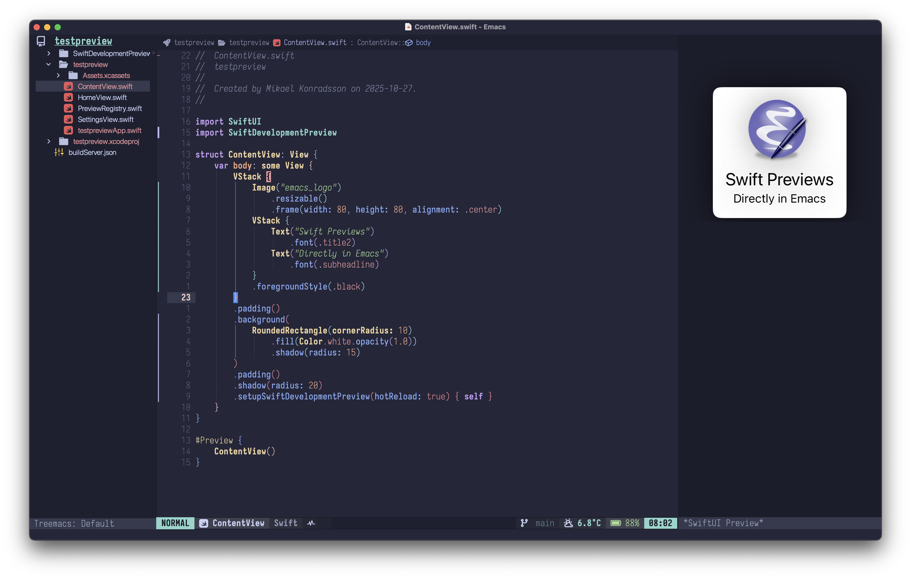
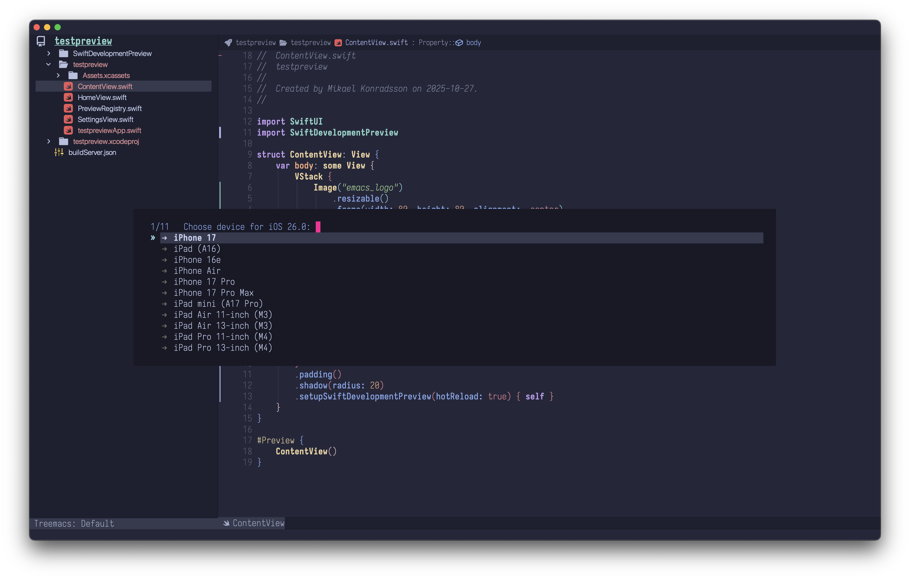
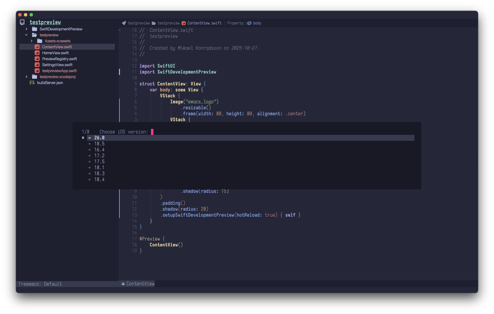
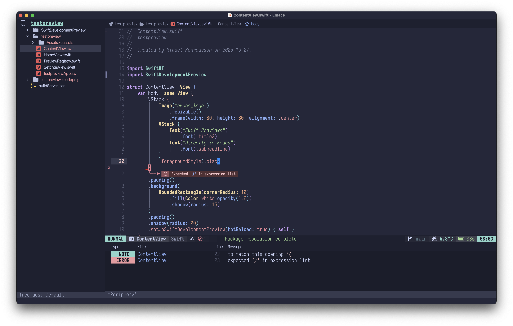
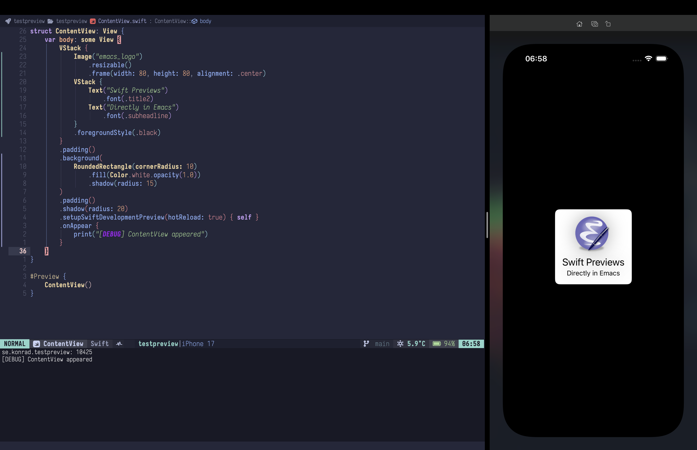
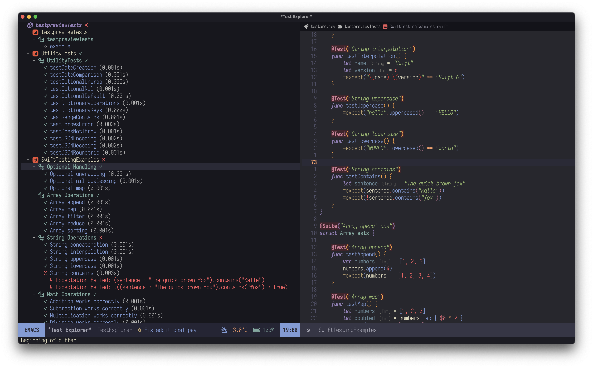

# swift-development - emacs

A comprehensive Emacs package for iOS and macOS development with Swift and Xcode.

<picture>
    
</picture>

## Sponsoring

[Please sponsor me if you like this package](https://github.com/sponsors/konrad1977)

## Incremental Builds (NEW)

The headline feature of swift-development is the **incremental build pipeline** that bypasses `xcodebuild` entirely for fast edit-compile-run cycles. Instead of running a full build (~189s), it replays only the compile and link steps needed for changed modules (~7-14s).

**Incremental builds are enabled by default.** No configuration is needed -- just build your project once with `xcodebuild` and incremental builds take over automatically from there.

### Quick Start

1. Build your project normally: `M-x swift-development-compile-and-run`
2. The first build uses full `xcodebuild` and caches compile/link commands automatically
3. Every subsequent build with changed files uses the fast incremental pipeline
4. That's it -- no manual setup required

### How It Works

Xcode uses a "debug dylib" architecture where SPM modules are compiled into relocatable `.o` files and linked into a single `App.debug.dylib`. The incremental build pipeline exploits this by:

1. Detecting which SPM modules have changed files (via `swift-file-watcher`)
2. Filtering out third-party modules (detected via `-suppress-warnings` in compile commands)
3. Recompiling only the changed internal module (`swiftc -incremental`)
4. Checking for API changes via `.swiftmodule` hash comparison
5. Cascade-recompiling downstream internal modules if API changed
6. Re-linking each module's `.o` (`clang -r`)
7. Re-linking the debug dylib (`clang -dynamiclib`)
8. Patching the `.app` bundle and re-signing
9. Installing and launching on the iOS Simulator

### Three-Stage Fallback

The system is designed to always succeed:

1. **Incremental build** -- Compile only changed internal modules (~7-14s)
2. **Cascade rebuild** -- If API changes detected or "Undefined symbols" error, rebuild downstream internal modules
3. **Full xcodebuild** -- Last resort if cascade also fails

### Toggling Incremental Builds

Incremental builds are **enabled by default** (`swift-incremental-build-enabled` is `t`).

```elisp
;; Disable incremental builds permanently
(setq swift-incremental-build-enabled nil)

;; Or toggle interactively
M-x swift-incremental-build-toggle
M-x swift-development-toggle-incremental-build  ;; wrapper command

;; Force one-shot full xcodebuild (resets automatically after one build)
M-x swift-development-force-full-build
```

### Incremental Build Commands

| Command | Key | Description |
|---------|-----|-------------|
| `swift-incremental-build-compile-and-run` | `C-c b i` | Incremental build + install + launch |
| `swift-incremental-build-compile` | `C-c b I` | Incremental build only (no install) |
| `swift-incremental-build-extract-commands` | `C-c b e` | Extract commands from a build log file |
| `swift-incremental-build-toggle` | | Toggle incremental builds on/off |
| `swift-incremental-build-show-modules` | | Display cached modules and their command status |
| `swift-incremental-build-show-compile-database` | | Show `.compile` database contents (`[internal]`/`[3rd-party]` counts) |
| `swift-incremental-build-show-dependency-graph` | | Show the reverse dependency graph (`[3p]` markers) |
| `swift-incremental-build-status` | | Show full diagnostics (including enabled/disabled state) |
| `swift-incremental-build-cancel` | | Cancel an in-progress build |
| `swift-incremental-build-clear-cache` | | Clear all cached commands and in-memory state |
| `swift-incremental-build-toggle-debug` | | Toggle verbose debug logging |

### Incremental Build Configuration

```elisp
;; Enable/disable incremental builds (default: t)
(setq swift-incremental-build-enabled t)

;; Codesign identity for re-signing the .app bundle (default: "-")
(setq swift-incremental-build-codesign-identity "-")

;; Max modules to build incrementally before falling back to xcodebuild (default: 4)
(setq swift-incremental-build-max-modules 4)

;; Max modules for cascade rebuild on API change (default: 25)
(setq swift-incremental-build-max-cascade-modules 25)

;; Enable verbose debug logging (default: nil)
(setq swift-incremental-build-debug nil)
```

### Automatic Integration

When `swift-development-compile-and-run` or `swift-development-compile-app` is called, the package automatically checks if an incremental build is possible via `swift-incremental-build-ready-p`. This check verifies:

1. Incremental builds are enabled
2. All changed modules have cached compile and link commands
3. The dylib link command is available
4. Build artifacts exist on disk
5. Number of changed modules does not exceed `swift-incremental-build-max-modules`

If any check fails, it falls back to full `xcodebuild`. After each full build, commands are automatically extracted and cached for next time. Switching schemes automatically clears the incremental build cache.

### API Change Detection

After compiling each module, the `.swiftmodule` hash (public interface) is compared against a persistent hash store saved to disk. If the hash differs, downstream internal modules are automatically added to the build queue. The persistent store eliminates hash flip-flop and survives Emacs restarts.

### Dependency Graph

The reverse dependency graph is built from actual `import` statements in source files. Only internal module sources are scanned (third-party modules are skipped). The graph is:
- Cached to disk (`dependency-graph-<scheme>`) for instant loading on Emacs restart
- Built asynchronously via idle timer if the disk cache is missing (does not block builds)
- Automatically cleared when switching schemes

### Third-Party Module Filtering

Modules are classified as internal or third-party at parse time by checking for the `-suppress-warnings` flag (Xcode adds this to all third-party SPM dependencies). Third-party modules are:
- Excluded from changed-modules detection
- Excluded from cascade rebuilds
- Excluded from source scanning for the dependency graph
- Marked with `[3p]` in diagnostic commands

### Bootstrap Workflow

On a fresh setup (no cached commands), run a single full `xcodebuild` -- compile and link commands are extracted automatically. Alternatively, use `swift-incremental-build-extract-commands` to manually extract from a saved build log file.

### Disk Cache Files

Stored in `.swift-development/` at your project root:
- `incremental-commands-<scheme>` -- Cached compile + link commands for all modules
- `dependency-graph-<scheme>` -- Reverse dependency graph (import-based)
- `swiftmodule-hashes-<scheme>` -- Persistent `.swiftmodule` hashes for API change detection

---

## Dependencies

> **Note:** This package is designed for **macOS only** as it requires Xcode and iOS Simulator.

### Required System Tools

These must be installed on your system:

- **macOS** - This package requires macOS as it integrates with Xcode and iOS Simulator
- **Xcode** - Full Xcode installation (not just Command Line Tools) is required for iOS development
- **Xcode Command Line Tools** - Required for command-line Swift compilation
  ```bash
  xcode-select --install
  ```

- **[xcode-build-server](https://github.com/SolaWing/xcode-build-server)** - Build Server Protocol for LSP integration
  ```bash
  brew install xcode-build-server
  ```

### Required Emacs Packages

Built-in packages (no installation needed):

- `project` - Built-in project management
- `json` - Built-in JSON support
- `compile` - Built-in compilation mode
- `cl-lib` - Built-in Common Lisp extensions

### Recommended Emacs Packages

For the best Swift editing experience:

- **[swift-ts-mode](https://codeberg.org/woolsweater/swift-ts-mode)** - Tree-sitter based Swift major mode (recommended)
  - Superior syntax highlighting and code navigation
  - Requires Emacs 29+ with tree-sitter support
  - Alternative: [swift-mode](https://github.com/swift-emacs/swift-mode) (traditional mode, install via MELPA)

- **[periphery](https://github.com/konrad1977/periphery)** - Enhanced error parsing and navigation for Swift
  - Beautiful error display and navigation
  - Automatic error highlighting and quickfix

### Optional Emacs Packages

These add extra features:

- **[dape](https://github.com/svaante/dape)** - Debug Adapter Protocol support for Emacs
  - Enables interactive debugging with breakpoints
  - Install via MELPA: `M-x package-install RET dape RET`

- **[request](https://github.com/tkf/emacs-request)** - HTTP request library
  - Required for Hacking with Swift integration
  - Install via MELPA: `M-x package-install RET request RET`

- **[mode-line-hud](https://github.com/konrad1977/punch-line/blob/master/mode-line-hud.el)** - Visual notifications in mode-line
  - Provides elegant build progress indicators
  - Install via Github

- **[knockknock](https://github.com/konrad1977/knockknock)** - Visual notifications
  - Provides elegant progress indicators in a posframe
  - Install via GitHub

- **[nerd-icons](https://github.com/rainstormstudio/nerd-icons.el)** - Icon support
  - Prettier UI elements
  - Install via MELPA: `M-x package-install RET nerd-icons RET`

- **[eglot](https://github.com/joaotavora/eglot)** - LSP client (built-in with Emacs 29+)
  - Enhanced Swift language server integration
  - Built-in with Emacs 29+, or install via MELPA for earlier versions

### Optional Debugging Tools

For advanced debugging features:

- **[vscode-lldb](https://marketplace.visualstudio.com/items?itemName=vadimcn.vscode-lldb)** - LLDB debugger adapter
  - Used with `dape` for debugging Swift/iOS apps
  - Install via VS Code marketplace or download from GitHub releases

## Features

### Core Functionality
- **Xcode Integration**: Build, run, and debug iOS apps directly from Emacs
- **Incremental Builds**: Bypass xcodebuild for 10-25x faster edit-compile-run cycles (enabled by default)
- **Multi-Project Support**: Work on multiple Swift projects simultaneously with buffer-local state
- **Simulator Management**: Control iOS simulators, view logs, and manage devices
- **Auto-Launch Simulator**: Automatically starts simulator when opening a project
- **Multi-Simulator Support**: Run apps on multiple simulators simultaneously
- **Smart Caching**: Automatic build cache warming for faster compilation
- **Ultra-Fast Rebuild Detection**: Last-modified file detection (10-50x faster than hash-based)
- **Persistent Settings**: Project settings survive Emacs restarts
- **Unified Mode Support**: Works seamlessly with both swift-mode and swift-ts-mode
- **LSP Support**: Enhanced Swift language server integration
- **Project Management**: Automatic scheme detection and project configuration
- **Error Handling**: Advanced error parsing and navigation
- **Flexible Notifications**: Choose between mode-line-hud, minibuffer, or custom notifications

### Developer Tools
- **SwiftUI Preview**: Generate and display SwiftUI view previews in Emacs
- **Build Optimization**: Turbo mode, balanced mode, and comprehensive build system optimization
- **Simulator Testing**: Push notifications, language switching, and localization testing
- **Xcode Tools**: Accessibility Inspector, Instruments profiling, and developer utilities
- **Error Handling**: Comprehensive diagnostics, error logging, and environment validation
- **Refactoring**: Code refactoring utilities for Swift
- **Documentation**: Query Apple Developer Documentation and Hacking with Swift
- **Localization**: Major mode for editing `.strings` files
- **Device Management**: Deploy and debug on physical iOS devices
- **Archive & Distribution**: Archive, export IPA, and upload to TestFlight
- **Test Explorer**: Interactive test tree with XCTest and Swift Testing support
- **File Watcher**: Real-time file change detection for incremental builds
- **Advanced Features**: Memory leak detection, code coverage, dependency analysis

## Screenshots

### SwiftUI Preview
Real-time SwiftUI view previews directly in Emacs with automatic generation and hot reload support.



### Simulator Selection
Choose from available iOS simulators with easy device selection.



### iOS Version Selection
Select specific iOS versions and device configurations.



### Periphery Integration
Built-in error detection and navigation with Periphery integration.



### iOS Simulator Console
Real-time simulator logs and debugging output directly in Emacs.



### Test Explorer
Interactive test explorer with tree view, XCTest and Swift Testing support, and inline error messages.



## Installation

### Prerequisites

- Emacs 28.1 or higher
- See the [Dependencies](#dependencies) section above for required system tools and packages

### Setup

1. Clone or download this repository to your Emacs load path:

```bash
git clone <repository-url> ~/.emacs.d/localpackages/swift
```

2. Add to your init.el:

```elisp
(add-to-list 'load-path "~/.emacs.d/localpackages/swift")

;; Load the main package
(require 'swift-development)
(require 'xcode-project)
(require 'xcode-build-config)

;; Optional modules
(require 'ios-simulator)
(require 'ios-device)
(require 'swift-refactor)
(require 'localizeable-mode)
```

## File Structure

```
swift-development/
├── README.md                      # This file
├── swift-development.el           # Main Swift development utilities
├── swift-development-mode.el      # Minor mode with unified keybindings
├── xcode-project.el               # Xcode project management
├── swift-project-settings.el      # Persistent project settings
├── swift-project.el               # Project utilities
├── xcode-build-config.el          # Build configuration and flags
├── xcode-build.el                 # Build system
├── xcode-clean.el                 # Clean build utilities
├── xcodebuildserver.el            # Build server configuration
├── swift-cache.el                 # Unified caching system
├── swift-file-watcher.el          # File change detection
├── swift-features.el              # Additional Swift features
├── swift-error-proxy.el           # Unified error parsing and handling
├── swift-async.el                 # Robust async process utilities
├── swift-lsp.el                   # LSP integration
├── swift-notification.el          # Unified notification system
├── swift-incremental-build.el     # Incremental build pipeline (bypasses xcodebuild)
├── swiftui-preview.el             # SwiftUI preview support
├── swiftui-preview-core.el        # Core SwiftUI preview utilities
├── swiftui-preview-dynamic.el     # Dynamic target injection preview
├── swiftui-preview-standalone.el  # Standalone Swift file preview
├── swiftui-preview-spm.el         # SPM package SwiftUI preview
├── swiftui-preview-setup.el       # Setup wizard for SwiftUI Preview
├── swift-refactor.el              # Refactoring tools
├── ios-simulator.el               # iOS Simulator integration
├── ios-device.el                  # Physical device management
├── swift-package-manager.el       # SPM dependency UI and build integration
├── swift-macro-manager.el         # Swift macro approval management (Swift 5.9+)
├── swift-test-explorer.el         # Test explorer with tree view and test running
├── xcode-archive.el               # Archive, export, and distribute to TestFlight
├── xcode-instruments.el           # Instruments profiling integration
├── localizeable-mode.el           # Localization file editing
├── apple-docs-query.el            # Apple documentation lookup
├── hacking-with-swift.el          # Hacking with Swift integration
└── templates/
    └── SwiftDevelopmentPreview/   # Swift package for preview support
```

---

## Module Reference

### swift-development.el

Main entry point with build orchestration, app running, and cache warming.

**Build & Run:**

| Command | Description |
|---------|-------------|
| `swift-development-compile-app` | Build the current project |
| `swift-development-compile-and-run` | Build and run in one command |
| `swift-development-run` | Rerun already compiled and installed app (no rebuild) |
| `swift-development-quick-rebuild` | Fast rebuild with all optimizations |
| `swift-development-build-swift-package` | Build Swift package module |
| `swift-development-ensure-built` | Ensure app is built (no-op if already built) |
| `swift-development-ensure-built-async` | Ensure app is built asynchronously |
| `swift-development-run-on-additional-simulator` | Run current app on an additional simulator |
| `swift-development-analyze-app` | Run static analysis using xcodebuild analyze |

**Build Modes & Optimization:**

| Command | Description |
|---------|-------------|
| `swift-development-enable-turbo-mode` | Maximum build speed optimizations |
| `swift-development-enable-balanced-mode` | Balanced speed/debugging |
| `swift-development-optimize-build-system` | Comprehensive build system optimization |
| `swift-development-enable-build-cache-sharing` | Enable build cache sharing between builds |
| `swift-development-benchmark-build` | Measure build performance |
| `swift-development-toggle-analysis-mode` | Cycle through analysis modes (fast/full/minimal) |
| `swift-development-set-fast-mode` | Set analysis to fast mode |
| `swift-development-set-minimal-mode` | Set analysis to minimal mode |
| `swift-development-toggle-continue-after-errors` | Toggle continue building after errors |

**Incremental Build Integration:**

| Command | Description |
|---------|-------------|
| `swift-development-toggle-incremental-build` | Toggle incremental builds on/off |
| `swift-development-force-full-build` | Force next build to use xcodebuild (one-shot) |

**Cache & Status:**

| Command | Description |
|---------|-------------|
| `swift-development-warm-build-cache` | Precompile system frameworks |
| `swift-development-build-status` | Show current build status |
| `swift-development-show-last-build-errors` | Display recent build errors |
| `swift-development-show-build-output` | Show the Swift build output buffer |
| `swift-development-hide-build-output` | Hide the Swift build output buffer |
| `swift-development-toggle-build-output` | Toggle visibility of build output buffer |
| `swift-development-toggle-build-output-buffer` | Toggle visibility of the build output buffer |
| `swift-development-reset-build-status` | Reset the build status tracking |
| `swift-development-clear-hash-cache` | Clear all cache files for the current project |
| `swift-development-clear-derived-data` | Clear Xcode's DerivedData folder |

**Diagnostics:**

| Command | Description |
|---------|-------------|
| `swift-development-diagnose` | Display comprehensive diagnostic information |
| `swift-development-diagnose-auto-warm` | Debug why automatic cache warming might not trigger |
| `swift-development-test-auto-warm` | Test automatic cache warming for current project |
| `swift-development-test-scheme-formatting` | Test scheme name formatting with various inputs |
| `swift-development-debug-current-scheme` | Debug current scheme name |

**Error Display:**

| Command | Description |
|---------|-------------|
| `swift-development-toggle-periphery-mode` | Toggle between periphery and compilation mode for errors |
| `swift-development-filter-errors` | Open periphery filter menu |

**Testing:**

| Command | Description |
|---------|-------------|
| `swift-development-test-swift-package` | Test Swift package from project root |
| `swift-development-test-swift-package-from-file` | Test Swift package from current file location |
| `swift-development-test-module-silent` | Test current module silently |

**Other:**

| Command | Description |
|---------|-------------|
| `swift-development-reset` | Reset all build settings and cached state |
| `swift-development-toggle-device-choice` | Toggle between simulator and physical device |
| `swift-development-fix-dependency-issues` | Fix CocoaPods and SPM issues |
| `swift-development-toggle-debug` | Toggle debug mode for all swift-development packages |

**Transient menu:** `M-x swift-development-transient`

---

### xcode-project.el

Xcode project and scheme management, build folders, and debugging. Uses buffer-local variables for multi-project support.

**Project Info & Configuration:**

| Command | Description |
|---------|-------------|
| `xcode-project-show-project-info` | Display current buffer's project information |
| `xcode-project-show-current-configuration` | Display the current Xcode project configuration |
| `xcode-project-select-scheme` | Interactively select a scheme for build/run |
| `xcode-project-select-test-scheme` | Interactively select a scheme for testing |
| `xcode-project-fetch-schemes` | Fetch available schemes and prompt for selection |
| `xcode-project-open-in-xcode` | Open project in Xcode |
| `xcode-project-open-build-folder` | Open build folder in Finder |
| `xcode-addition-ask-for-device-or-simulator` | Show menu for running on simulator or device |

**Build Control:**

| Command | Description |
|---------|-------------|
| `xcode-project-interrupt-build` | Stop current build |
| `xcode-project-kill-all-xcodebuild-processes` | Kill all xcodebuild processes system-wide |
| `xcode-project-check-compile-lock-error` | Check if build output contains compile.lock error |
| `xcode-project-build-status` | Show status of current build process |

**Debugging:**

| Command | Description |
|---------|-------------|
| `xcode-project-start-debugging` | Launch debugger (requires dape) |
| `xcode-project-setup-dape` | Setup and start dape for iOS debugging |

**Xcode Developer Tools:**

| Command | Description |
|---------|-------------|
| `xcode-project-accessibility-inspector` | Launch Accessibility Inspector |
| `xcode-project-instruments` | Launch Instruments |

**Clean & Reset:**

| Command | Description |
|---------|-------------|
| `xcode-project-reset` | Reset project configuration |
| `xcode-project-clean-build-folder` | Clean app build folder and caches |
| `xcode-project-deep-clean` | Deep clean: build folder, package caches, all derived data |

**Cache & Diagnostics:**

| Command | Description |
|---------|-------------|
| `xcode-project-cache-diagnostics` | View cache status |
| `xcode-project-debug-build-folder-detection` | Debug build folder detection |
| `xcode-project-clear-build-folder-cache` | Clear cached build folder |
| `xcode-project-warm-cache` | Warm up xcode-project caches asynchronously |
| `xcode-project-toggle-debug` | Toggle debug mode for xcode-project |

**Transient menu:** `M-x xcode-project-transient`

---

### xcode-build.el

Direct Xcode build system integration.

| Command | Description |
|---------|-------------|
| `xcode-build-build` | Start a build using Xcode with optimized settings |
| `xcode-build-run` | Run application from Xcode |
| `xcode-build-stop` | Stop application from Xcode |
| `xcode-build-test` | Run current test scheme from Xcode |
| `xcode-build-clean` | Clean the project in Xcode |
| `xcode-build-clean-build-folder` | Clean the build folder in Xcode |

---

### xcode-build-config.el

Build configuration, command construction, and optimization flags with intelligent caching.

**Commands:**

| Command | Description |
|---------|-------------|
| `xcode-build-config-resolve-packages-async` | Resolve Swift package dependencies asynchronously |
| `xcode-build-config-invalidate-package-resolution` | Invalidate package resolution cache |
| `xcode-build-config-package-resolution-status` | Show status of package resolution for current project |

**Key variables:**
- `xcode-build-config-other-swift-flags` - Custom Swift compiler flags
- `xcode-build-config-default-configuration` - Default build configuration
- `xcode-build-config-skip-package-resolution` - Package resolution strategy (`'auto`, `'always`, `'never`)
- `xcode-build-config-parallel-jobs-multiplier` - CPU cores multiplier for parallel jobs (default: 2)
- `xcode-build-config-link-jobs-divisor` - Divisor for link jobs to reduce memory usage (default: 2)
- `xcode-build-config-swift-exec-memlimit` - Memory limit in MB for Swift compiler (default: 8192)

---

### xcode-clean.el

Clean build utilities.

| Command | Description |
|---------|-------------|
| `xcode-clean-swift-package-caches` | Clean Swift package manager caches safely |
| `xcode-clean-project-derived-data` | Clean Xcode derived data for a project |
| `xcode-clean-all-derived-data` | Clean all Xcode derived data |
| `xcode-clean-xcodebuild` | Run `xcodebuild clean` for current scheme |

---

### swift-project-settings.el

Persistent project settings that survive Emacs restarts. Settings are stored per-project and automatically loaded into buffer-local variables.

| Command | Description |
|---------|-------------|
| `swift-project-settings-save` | Save project settings to disk |
| `swift-project-settings-load` | Load settings from previous session |
| `swift-project-settings-show-diagnostics` | View current project settings |
| `swift-project-settings-clear` | Clear saved settings |
| `swift-project-settings-clear-all-cache` | Clear all cache files |

**What it saves:**
- Selected scheme and build configuration
- Simulator selection (device name and ID)
- Device platform (simulator or physical device)
- App identifier and build folder
- Last modified file (for ultra-fast rebuild detection)
- Build configuration (Debug, Release, etc.)

**Storage location:** `.swift-development/` directory in your project root

**Auto-launch simulator:**
When `swift-development-auto-launch-simulator` is `t` (default), the simulator automatically starts when you open a project with saved settings. Disable with:
```elisp
(setq swift-development-auto-launch-simulator nil)
```

---

### swift-project.el

Project root detection and utilities.

| Command | Description |
|---------|-------------|
| `swift-project-clear-cache` | Clear the project root cache |
| `swift-project-debug-root-detection` | Debug the project root detection process |

---

### swift-cache.el

High-performance caching system for expensive operations.

| Command | Description |
|---------|-------------|
| `swift-cache-clear` | Clear all cached data |
| `swift-cache-stats` | Display cache statistics |

---

### swift-lsp.el

Language Server Protocol (LSP) integration for Swift with proper iOS simulator support.

| Command | Description |
|---------|-------------|
| `swift-lsp-clear-cache` | Clear LSP path caches |

**Setup with eglot:**
```elisp
(require 'swift-lsp)
(require 'eglot)
(add-to-list 'eglot-server-programs
             '(swift-ts-mode . swift-lsp-eglot-server-contact))
```

The LSP configuration automatically locates `sourcekit-lsp`, configures the iOS simulator SDK path, sets up the correct target triple, and adds necessary compiler flags for UIKit/SwiftUI development.

---

### swift-file-watcher.el

Real-time file change detection used by the incremental build system to detect which SPM modules have modified files.

| Command | Description |
|---------|-------------|
| `swift-file-watcher-start` | Start watching project root for file changes |
| `swift-file-watcher-stop` | Stop all file watchers |
| `swift-file-watcher-restart` | Restart file watchers for current project |
| `swift-file-watcher-status` | Display status information about the file watcher |

---

### swift-error-proxy.el

Unified error parsing and handling proxy.

| Command | Description |
|---------|-------------|
| `swift-error-proxy-toggle-buffer` | Toggle the error/compilation buffer |

---

### xcodebuildserver.el

Automatic Build Server Protocol (BSP) configuration for LSP integration.

| Command | Description |
|---------|-------------|
| `xcodebuildserver-regenerate-configuration` | Regenerate BSP config for the current project |
| `xcodebuildserver-ensure-build-root` | Add `build_root` to existing configuration |

**build_root Support (xcode-build-server 1.3.0+):**
The package automatically sets the `build_root` property in `buildServer.json`, which points to your project's DerivedData folder. This enables reliable cross-file "go to definition" and "find references."

---

### ios-simulator.el

iOS Simulator control and log viewing with syntax-highlighted console output.

**Selection & Lifecycle:**

| Command | Description |
|---------|-------------|
| `ios-simulator-choose-simulator` | Select a simulator (iOS version first, then device) |
| `ios-simulator-boot` | Boot the selected simulator |
| `ios-simulator-shutdown` | Shutdown the current simulator |
| `ios-simulator-shutdown-simulator` | Shutdown a specific simulator by ID |
| `ios-simulator-shut-down-all` | Shutdown all running simulators |
| `ios-simulator-restart` | Restart the simulator |
| `ios-simulator-erase` | Erase all content and settings from current simulator |
| `ios-simulator-reset` | Reset current simulator settings |
| `ios-simulator-reset-selection` | Reset the current simulator selection |
| `ios-simulator-list-booted` | List all currently booted simulators |

**App Management:**

| Command | Description |
|---------|-------------|
| `ios-simulator-terminate-current-app` | Terminate the current app |
| `ios-simulator-list-apps` | List all apps installed on current simulator |
| `ios-simulator-uninstall-app` | Uninstall app by bundle ID |
| `ios-simulator-uninstall-current-app` | Uninstall the current project's app |
| `ios-simulator-appcontainer` | Get the app container of the current app |
| `ios-simulator-app-container` | Get container path for a bundle ID |
| `ios-simulator-open-app-data` | Open app's data container in Finder |
| `ios-simulator-open-app-bundle` | Open app's bundle container in Finder |

**Multi-Simulator Support:**

| Command | Description |
|---------|-------------|
| `ios-simulator-add-target-simulator` | Add a simulator to the target list |
| `ios-simulator-remove-target-simulator` | Remove a simulator from the target list |
| `ios-simulator-list-target-simulators` | List all target simulators |
| `ios-simulator-clear-target-simulators` | Clear all targets (back to single simulator mode) |
| `ios-simulator-run-on-additional-simulator` | Run app on an additional simulator |
| `ios-simulator-install-and-run-on-additional-simulator` | Install and run app on an additional simulator |
| `ios-simulator-list-active-simulators` | List all active simulators with running apps |
| `ios-simulator-terminate-app-on-simulator` | Terminate app on a specific simulator |

**Screenshots & Recording:**

| Command | Description |
|---------|-------------|
| `ios-simulator-screenshot` | Take a screenshot |
| `ios-simulator-screenshot-to-clipboard` | Take a screenshot and copy to clipboard |
| `ios-simulator-start-recording` | Start recording video |
| `ios-simulator-stop-recording` | Stop current video recording |
| `ios-simulator-toggle-recording` | Toggle video recording on/off |

**Location:**

| Command | Description |
|---------|-------------|
| `ios-simulator-set-location` | Set simulator GPS location |
| `ios-simulator-set-location-preset` | Set location from preset list |
| `ios-simulator-clear-location` | Clear/reset the simulated location |

**Status Bar:**

| Command | Description |
|---------|-------------|
| `ios-simulator-status-bar-override` | Override status bar appearance for screenshots |
| `ios-simulator-status-bar-apple-style` | Set status bar to Apple's marketing style (9:41) |
| `ios-simulator-status-bar-clear` | Clear status bar overrides |

**Privacy:**

| Command | Description |
|---------|-------------|
| `ios-simulator-privacy-grant` | Grant privacy permission for a service |
| `ios-simulator-privacy-revoke` | Revoke privacy permission |
| `ios-simulator-privacy-reset` | Reset privacy permission (will ask again) |
| `ios-simulator-privacy-grant-all` | Grant all privacy permissions to current app |

**Clipboard & Notifications:**

| Command | Description |
|---------|-------------|
| `ios-simulator-paste-to-simulator` | Paste text to simulator clipboard |
| `ios-simulator-paste-from-kill-ring` | Paste kill-ring entry to simulator clipboard |
| `ios-simulator-copy-from-simulator` | Copy simulator clipboard to Emacs kill-ring |
| `ios-simulator-send-notification` | Send push notification to app |

**URL Handling:**

| Command | Description |
|---------|-------------|
| `ios-simulator-open-url` | Open URL in simulator's default browser |
| `ios-simulator-open-url-in-app` | Open URL in current app (deep links/universal links) |

**Language:**

| Command | Description |
|---------|-------------|
| `ios-simulator-change-language` | Change simulator language |

**Output & Cache:**

| Command | Description |
|---------|-------------|
| `ios-simulator-toggle-buffer` | Toggle visibility of simulator output buffer |
| `ios-simulator-invalidate-cache` | Force refresh of simulator device cache |
| `ios-simulator-preload-cache` | Pre-load simulator device cache in background |
| `ios-simulator-clear-sdk-cache` | Clear SDK/arch cache |
| `ios-simulator-cleanup-global-state` | Clean up global hash tables |
| `ios-simulator-cleanup-stale-entries` | Remove entries for non-existent simulators |
| `ios-simulator-menu` | Show an interactive menu of simulator commands |

**Transient menu:** `M-x ios-simulator-transient`

#### Colorized Console Output

The simulator output buffer features syntax highlighting for easier log analysis:
- **Errors (Red):** ObjC runtime errors, NSError/Cocoa errors, ThreadSanitizer/AddressSanitizer, fatal signals, HTTP 4xx/5xx
- **Warnings (Yellow):** Warning messages, log levels
- **Informational:** Timestamps (dimmed), categories (highlighted), URLs (clickable), file paths (underlined), HTTP 2xx (green)

Configuration:
```elisp
;; Disable colorized output (default: t)
(setq ios-simulator-colorize-output nil)
```

---

### ios-device.el

Physical device deployment and debugging.

| Command | Description |
|---------|-------------|
| `ios-device-choose-device` | Select a connected device |
| `ios-device-select-device` | Select a physical device with a single prompt |
| `ios-device-start-logging` | Stream logs from physical device |
| `ios-device-stop-logging` | Stop the device log streaming |
| `ios-device-clear-log` | Clear the device log buffer |
| `ios-device-screenshot` | Take screenshot from device |
| `ios-device-reset` | Reset device selection and state |
| `ios-device-clear-cache` | Clear all device detection caches |
| `ios-device-debug-output` | Show raw devicectl output for debugging |

**Transient menu:** `M-x ios-device-transient`

---

### swift-refactor.el

Code refactoring utilities for Swift.

**Extract & Wrap:**

| Command | Description |
|---------|-------------|
| `swift-refactor-extract-function` | Extract active region to its own function |
| `swift-refactor-wrap-selection` | Wrap selected region in a named block |
| `swift-refactor-insert-around` | Insert element around selection |
| `swift-refactor-add-try-catch` | Add try-catch around code |

**Delete & Clean:**

| Command | Description |
|---------|-------------|
| `delete-to-next-closing-brace` | Delete text between current line and next closing brace |
| `swift-refactor-delete-until-balancing-char` | Delete current line with opening brace and its matching closing brace |
| `swift-refactor-delete-current-line-with-matching-brace` | Delete current line starting with `{` and matching `}` |
| `swift-refactor-tidy-up-constructor` | Clean up `Type.init(...)` to `Type(...)` |

**Code Navigation & Insertion:**

| Command | Description |
|---------|-------------|
| `code-refactor-split-function-list` | Split function parameters/arguments to individual lines |
| `swift-refactor-functions-and-pragmas` | Show compressed functions and pragmas |
| `swift-refactor-print-thing-at-point` | Print debug statement for thing at point |
| `swift-refactor-insert-mark` | Insert a MARK comment |
| `swift-refactor-insert-todo` | Insert a TODO comment |

**Formatting & Linting:**

| Command | Description |
|---------|-------------|
| `swift-refactor-format-buffer` | Format current buffer with swiftformat |
| `swift-refactor-format-region` | Format region with swiftformat |
| `swift-refactor-lint-project` | Run SwiftLint on the project |
| `swift-refactor-lint-file` | Run SwiftLint on current file |
| `swift-refactor-fix-file` | Auto-fix SwiftLint issues in current file |

---

### swift-package-manager.el

Interactive UI for managing Swift Package Manager dependencies with build integration.

**Package Management:**

| Command | Description |
|---------|-------------|
| `spm-list-dependencies` | Show all dependencies in a dedicated buffer |
| `spm-add-package` | Add a new Swift package (supports GitHub shorthand: `user/repo`) |
| `spm-remove-package` | Remove a package interactively |
| `spm-update-package` | Update a specific package |
| `spm-update-all` | Update all packages to latest compatible versions |
| `spm-resolve` | Resolve package dependencies |
| `spm-dependency-graph` | Generate DOT-format dependency graph |
| `spm-clean-cache` | Clean SPM cache directories |
| `spm-describe-package` | Show package description |
| `spm-create-package` | Create a new Swift package |
| `spm-refresh` | Refresh the dependencies list |

**Build Integration:**

| Command | Description |
|---------|-------------|
| `spm-check-status` | Check and display Swift package status |
| `spm-watch-download` | Watch package download progress in real-time |
| `spm-monitor-build-progress` | Monitor build progress with package status updates |
| `spm-prebuild` | Pre-build Swift packages to speed up builds |
| `spm-clean-build-dir` | Clean .build directory |
| `spm-toggle-resolution-mode` | Toggle package resolution mode (auto/always/never) |
| `spm-force-resolve` | Force package resolution on next build |

**Transient menu:** `M-x spm-transient`

---

### swift-macro-manager.el

Swift macro approval management (Swift 5.9+). Swift macros from SPM packages require explicit approval before use.

| Command | Description |
|---------|-------------|
| `spm-macro-approve-unapproved` | Approve all unapproved macros from last build |
| `spm-macro-list-approved` | Display currently approved macros |
| `spm-macro-inspect-source` | Open macro source files for review |
| `spm-macro-remove-approval` | Remove approval for a macro |
| `spm-macro-approve-interactive` | Manually approve a macro by entering details |

**Automatic flow:** Build fails with macro error -> package detects and prompts -> approve and rebuild -> build succeeds.

```elisp
;; Enable auto-approval without prompting (use with caution!)
(setq spm-macro-auto-approve nil)  ; Default: nil
```

---

### swift-test-explorer.el

Test Explorer for Swift/iOS development with tree view UI and test running.


**Explorer Window:**

| Command | Description |
|---------|-------------|
| `swift-test-explorer-show` | Open the test explorer window |
| `swift-test-explorer-toggle` | Toggle test explorer visibility |
| `swift-test-explorer-quit` | Close the test explorer window |
| `swift-test-explorer-refresh` | Discover/refresh tests |
| `swift-test-explorer-clear` | Clear all test results (keeps structure) |
| `swift-test-explorer-reset` | Reset completely (clears everything, rediscovers) |

**Navigation:**

| Command | Description |
|---------|-------------|
| `swift-test-explorer-toggle-or-goto` | Toggle node expansion or goto source |
| `swift-test-explorer-toggle-expand` | Toggle expansion of node at point |
| `swift-test-explorer-expand-all` | Expand all nodes |
| `swift-test-explorer-collapse-all` | Collapse all nodes |
| `swift-test-explorer-goto-test` | Jump to test source at point |
| `swift-test-explorer-prev-failed` | Jump to previous failed test |
| `swift-test-explorer-next-failed` | Jump to next failed test |
| `swift-test-explorer-help` | Show help |

**Run Tests:**

| Command | Description |
|---------|-------------|
| `swift-test-explorer-run-at-point` | Run test(s) at cursor position |
| `swift-test-explorer-run-all` | Run all tests in project |
| `swift-test-explorer-run-failed` | Re-run failed tests |

**Debugging:**

| Command | Description |
|---------|-------------|
| `swift-test-explorer-show-last-output` | Show last test output for debugging |
| `swift-test-explorer-debug-errors` | Show all failed tests and error messages |

**Standalone Test Commands (usable outside explorer):**

| Command | Description |
|---------|-------------|
| `swift-test-run-at-point` | Run the test at point in current buffer |
| `swift-test-run-class` | Run all tests in current class |
| `swift-test-run-all` | Run all tests in the project |
| `swift-test-run-failed` | Re-run failed tests |
| `swift-test-set-scheme` | Set the test scheme for current project |
| `swift-test-select-scheme` | Select the test scheme (transient suffix) |
| `swift-test-select-all-tests-scheme` | Select scheme for running ALL tests |
| `swift-test-clear-scheme-cache` | Clear cached scheme selections |
| `swift-test-clear-package-schemes` | Clear cached package scheme mappings |
| `swift-test-add-target-to-scheme` | Add a test target to a scheme's test action |
| `swift-test-add-target-to-scheme-suffix` | Add a test target to a scheme (transient suffix) |

**Test Explorer Keybindings:**

| Key | Action |
|-----|--------|
| `RET` | Jump to source or toggle expand |
| `TAB` | Toggle expand/collapse |
| `o` | Jump to test source |
| `x` / `C-c C-c` | Run test at point |
| `X` | Run all tests |
| `r` | Re-run failed tests |
| `R` / `g` | Refresh/discover tests |
| `c` | Clear results |
| `S` | Set scheme |
| `[` | Previous failed test |
| `]` | Next failed test |
| `n` / `j` | Next line |
| `p` / `k` | Previous line |
| `q` | Close explorer |
| `?` | Show help |

**Transient menu:** `M-x swift-test-transient`

---

### xcode-archive.el

Archive, export, and distribute iOS apps to TestFlight.

**Configuration:**

| Command | Description |
|---------|-------------|
| `xcode-archive-configure` | Interactive configuration wizard |
| `xcode-archive-show-config` | Display current archive/distribution configuration |
| `xcode-archive-set-team-id` | Set the Development Team ID |
| `xcode-archive-set-api-key` | Set the App Store Connect API Key ID |
| `xcode-archive-set-api-issuer` | Set the App Store Connect API Issuer ID |
| `xcode-archive-set-api-key-path` | Set path to the API private key (.p8 file) |
| `xcode-archive-set-export-method` | Set the export method interactively |

**Build & Distribute:**

| Command | Description |
|---------|-------------|
| `xcode-archive-archive-app` | Archive the current Xcode project |
| `xcode-archive-export-ipa` | Export an IPA from an .xcarchive |
| `xcode-archive-upload-to-testflight` | Upload IPA to TestFlight |
| `xcode-archive-validate-app` | Validate IPA before uploading |
| `xcode-archive-distribute` | Full pipeline: archive, export, upload to TestFlight |
| `xcode-archive-cancel` | Cancel current archive/export/upload operation |
| `xcode-archive-show-log` | Show the archive log buffer |

---

### xcode-instruments.el

Xcode Instruments integration for profiling iOS apps.

| Command | Description |
|---------|-------------|
| `xcode-instruments-run` | Run Instruments with a selected template |
| `xcode-instruments-stop` | Stop the current Instruments recording |
| `xcode-instruments-open-trace` | Open a trace file in Instruments |
| `xcode-instruments-open-latest-trace` | Open the most recent trace file |
| `xcode-instruments-list-templates` | List available Instruments templates |
| `xcode-instruments-clean-traces` | Delete old trace files to free disk space |
| `xcode-instruments-quick-profile` | Quick profile with Time Profiler for 10 seconds |
| `xcode-instruments-memory-profile` | Profile memory allocations |
| `xcode-instruments-leaks-profile` | Check for memory leaks |

**Transient menu:** `M-x xcode-instruments-transient`

---

### swiftui-preview.el

Fully automatic SwiftUI preview generation and display within Emacs with intelligent view routing, #Preview macro support, and zero-config setup.

**Core Commands:**

| Command | Description |
|---------|-------------|
| `swiftui-preview-generate` | Generate preview for current view (`C-c C-p`) |
| `swiftui-preview-generate-all` | Generate previews for all #Preview blocks |
| `swiftui-preview-select` | Select which #Preview to generate |
| `swiftui-preview-show-existing` | Show existing preview without regenerating |
| `swiftui-preview-refresh` | Refresh currently displayed preview |
| `swiftui-preview-clear` | Clear all preview images and wrapper files |
| `swiftui-preview-clean-temp-files` | Clean only auto-generated wrapper files |
| `swiftui-preview-show-directory` | Open preview directory in Dired |
| `swiftui-preview-cleanup` | Clean up injected preview targets |
| `swiftui-preview-setup` | Open the SwiftUI Preview setup wizard |

**Capture Commands:**

| Command | Description |
|---------|-------------|
| `swiftui-preview-capture-simulator` | Capture screenshot of current simulator state |
| `swiftui-preview-capture-after-delay` | Wait then capture simulator screenshot |
| `swiftui-preview-capture-current` | Immediately capture and display simulator state |

**Auto Features:**

| Command | Description |
|---------|-------------|
| `swiftui-preview-enable-auto-show` | Enable auto-show on file open |
| `swiftui-preview-disable-auto-show` | Disable auto-show |
| `swiftui-preview-enable-auto-generate` | Enable auto-generation on file open |
| `swiftui-preview-disable-auto-generate` | Disable auto-generation |
| `swiftui-preview-enable-auto-update` | Enable auto-update on save |
| `swiftui-preview-disable-auto-update` | Disable auto-update |
| `swiftui-preview-test-auto-show` | Test auto-show functionality |

**Settings:**

| Command | Description |
|---------|-------------|
| `swiftui-preview-toggle-debug` | Toggle debug messages |
| `swiftui-preview-toggle-pin-mode` | Toggle pin mode for preview window |
| `swiftui-preview-toggle-notifications` | Toggle preview progress notifications |

**Transient menu:** `M-x swiftui-preview-transient`

#### SwiftUI Preview Sub-Modules

**swiftui-preview-core.el:**

| Command | Description |
|---------|-------------|
| `swiftui-preview-core-toggle-verbose` | Toggle verbose mode for all preview modules |

**swiftui-preview-dynamic.el:**

| Command | Description |
|---------|-------------|
| `swiftui-preview-dynamic-generate` | Generate preview using dynamic target injection |
| `swiftui-preview-dynamic-cleanup` | Clean up injected PreviewHost target |
| `swiftui-preview-dynamic-select` | Select which #Preview to generate |
| `swiftui-preview-dynamic-refresh-live` | Take screenshot of running live preview app |
| `swiftui-preview-dynamic-stop-live` | Stop the live preview app |
| `swiftui-preview-dynamic-toggle-live-mode` | Toggle between snapshot and live preview mode |
| `swiftui-preview-dynamic-toggle-verbose` | Toggle verbose mode |

**swiftui-preview-standalone.el:**

| Command | Description |
|---------|-------------|
| `swiftui-preview-standalone-generate` | Generate preview for standalone Swift file |
| `swiftui-preview-standalone-check` | Check if file is suitable for standalone preview |

**swiftui-preview-spm.el:**

| Command | Description |
|---------|-------------|
| `swiftui-preview-spm-generate` | Generate preview for file in SPM package |
| `swiftui-preview-spm-check` | Check if file is in an SPM package |

**swiftui-preview-setup.el:**

| Command | Description |
|---------|-------------|
| `swiftui-preview-setup-wizard` | Open the setup wizard |
| `swiftui-preview-setup-check` | Check if all dependencies are satisfied |
| `swiftui-preview-setup-wizard-refresh` | Refresh the setup wizard display |
| `swiftui-preview-setup-wizard-install-gem` | Install xcodeproj gem from wizard |
| `swiftui-preview-setup-wizard-install-xcode` | Install Xcode CLI tools from wizard |
| `swiftui-preview-setup-wizard-action` | Perform context-sensitive action |

#### Quick Start

1. Open any Swift file -> Run `M-x swiftui-preview-generate` or `C-c C-p`
2. SwiftDevelopmentPreview package is installed automatically
3. PreviewRegistry.swift is created automatically
4. Preview appears!

Write standard #Preview macros (Xcode-compatible):
```swift
import SwiftUI
import SwiftDevelopmentPreview

struct ContentView: View {
    var body: some View {
        VStack {
            Text("Hello, World!")
        }
    }
}

#Preview("Light Mode") {
    ContentView()
}

#Preview("Dark Mode") {
    ContentView()
        .preferredColorScheme(.dark)
}
```

#### Configuration

```elisp
;; Auto-show existing previews when opening files (default: t)
(setq swiftui-preview-auto-show-on-open t)

;; Auto-generate missing previews (default: nil)
(setq swiftui-preview-auto-generate-on-open nil)

;; Auto-update preview when saving files (default: t)
(setq swiftui-preview-auto-update-on-save t)

;; Multiple preview support (default: t)
(setq swiftui-preview-multiple-previews-enabled t)

;; Preview window width (fraction, default: 0.25)
(setq swiftui-preview-window-width 0.25)

;; Preview timeout in seconds (default: 30)
(setq swiftui-preview-timeout 30)

;; Use incremental build commands for preview (default: t)
(setq swiftui-preview-dynamic-use-incremental t)
```

---

### swift-features.el

Additional advanced features for power users.

| Command | Description |
|---------|-------------|
| `swift-features-swiftui-preview-start` | Start SwiftUI preview (alternative implementation) |
| `swift-features-swiftui-preview-stop` | Stop SwiftUI preview |
| `swift-features-run-tests-with-coverage` | Run tests with code coverage reporting |
| `swift-features-profile-build` | Profile build performance |
| `swift-features-launch-multiple-simulators` | Launch app on multiple simulators |
| `swift-features-terminate-all-simulators` | Terminate app on all active simulators |
| `swift-features-add-local-package` | Add a local Swift package to the project |
| `swift-features-check-memory-leaks` | Run memory leak detection |
| `swift-features-generate-documentation` | Generate project documentation |
| `swift-features-analyze-dependencies` | Analyze and visualize dependencies |
| `swift-features-quick-actions` | Show quick actions menu |

---

### apple-docs-query.el / hacking-with-swift.el

Quick documentation lookup from Emacs.

| Command | Description |
|---------|-------------|
| `apple-docs/query` | Search Apple Developer Documentation |
| `apple-docs/query-thing-at-point` | Search Apple docs for symbol at point |
| `hacking-ws/query` | Search Hacking with Swift tutorials |
| `hacking-ws/query-thing-at-point` | Search Hacking with Swift for symbol at point |

---

### localizeable-mode.el

Major mode for editing .strings localization files with syntax highlighting. No interactive commands -- provides font-lock rules and mode setup.

---

## Build Performance & Optimization

### Turbo Mode

`swift-development-enable-turbo-mode` -- Maximum build speed:
- Disables Whole Module Optimization (`-no-whole-module-optimization`)
- Disables Thin LTO
- Enables Build Timing Summary
- Resets Build Cache

### Balanced Mode

`swift-development-enable-balanced-mode` -- Balanced speed with debugging.

### Build System Optimization

`swift-development-optimize-build-system` -- Comprehensive optimization:
1. Clears Module Cache
2. Stops SPM Daemons
3. RAM Disk Detection
4. Generates Optimized xcconfig
5. Cleans SPM Cache

### Build Benchmarking

`swift-development-benchmark-build` -- Measure build performance.

### Running Without Rebuilding

`swift-development-run` -- Run already-built app without recompiling.

### Deep Cleaning

`xcode-project-deep-clean` -- Nuclear option: removes `.build`, all Swift package caches, entire DerivedData directory.

---

## Ultra-Fast Rebuild Detection

Uses last-modified file detection (0.1-0.5s for 1000+ files) instead of hash-based scanning.

1. Single `find | stat | sort | head` command finds the most recently modified file
2. Compares timestamp + filepath with saved value in settings
3. 10-50x faster than hash-based detection
4. Persistent across Emacs restarts

```elisp
;; Customize which files trigger rebuilds
(setq swift-development-watched-extensions
      '("swift" "m" "mm" "h" "c" "cpp" "storyboard" "xib" "xcassets"))

;; Customize ignored paths
(setq swift-development-ignore-paths
      '("*Tests/*" "*/Tests.swift" "*UITests/*"))
```

---

## Simulator Testing Features

### Push Notifications

`ios-simulator-send-notification` -- Test notification handling without APNs.

### Localization Testing

`ios-simulator-change-language` -- Change simulator language for testing.

### Simulator Utilities

- `ios-simulator-toggle-buffer` -- Show/hide simulator output
- `ios-simulator-appcontainer` -- Open app's container directory
- `ios-simulator-open-app-data` -- Open data container in Finder
- `ios-simulator-screenshot` / `ios-simulator-screenshot-to-clipboard` -- Screenshots
- `ios-simulator-toggle-recording` -- Video recording
- `ios-simulator-set-location-preset` -- GPS location
- `ios-simulator-status-bar-apple-style` -- Marketing-style status bar

---

## Multi-Simulator Support

Run your app on multiple simulators simultaneously.

```elisp
;; Add simulators to target list
M-x ios-simulator-add-target-simulator

;; List / remove / clear targets
M-x ios-simulator-list-target-simulators
M-x ios-simulator-remove-target-simulator
M-x ios-simulator-clear-target-simulators

;; Run on additional simulator ad-hoc
M-x ios-simulator-run-on-additional-simulator
```

---

## Error Handling & Diagnostics

| Command | Description |
|---------|-------------|
| `swift-error-proxy-toggle-buffer` | Toggle the error/compilation buffer |
| `swift-development-show-last-build-errors` | Show recent build errors |
| `swift-development-diagnose` | Comprehensive diagnostics |
| `swift-development-diagnose-auto-warm` | Debug cache warming |
| `swift-development-toggle-periphery-mode` | Toggle error display format |

---

## Swift Development Mode

`swift-development-mode` is a minor mode that provides a unified keymap and hook system across all Swift-related buffers.

### Activation

Automatically activates for:
- Swift source files (both `swift-mode` and `swift-ts-mode`)
- Localizeable .strings files
- iOS simulator output buffers

### Key Bindings

#### Transient Menu
- `C-c s` - Open main transient menu (`swift-development-transient`)

#### Build & Run
- `C-c C-c` - Compile and run app
- `C-c C-b` - Compile app only
- `M-r` - Run last built app
- `C-c C-x` - Reset build state
- `C-c b s` - Show build status

#### Testing
- `C-c t m` - Run tests for current module
- `C-c t p` - Run Swift package tests

#### Simulator Control
- `M-s` - Terminate current app in simulator
- `C-x s n` - Send push notification
- `C-x s t` - Toggle simulator output buffer
- `C-x s l` - Change simulator language

#### Xcode Integration
- `M-K` - Clean build folder
- `C-c C-d` - Start debugging
- `C-c x t` - Toggle device/simulator
- `C-c x c` - Show current configuration

#### Refactoring
- `M-t` - Insert TODO comment
- `M-m` - Insert MARK comment
- `C-c r a` - Wrap selection in block
- `C-c r d` - Delete matching braces
- `C-c r i` - Tidy up constructor
- `C-c r r` - Extract function
- `M-P` - Print debug statement
- `C-c r t` - Add try-catch
- `C-c r s` - Split function parameters

#### Code Navigation
- `C-x p t` - Toggle periphery buffer
- `C-c C-f` - Search with ripgrep

---

## Transient Menus

All major functionality is accessible via transient menus (magit-style popups):

| Menu | Command | Description |
|------|---------|-------------|
| Main | `swift-development-transient` | Status display, build, run, settings |
| Simulator | `ios-simulator-transient` | Full simulator control |
| Device | `ios-device-transient` | Physical device management |
| SPM | `spm-transient` | Package management |
| Preview | `swiftui-preview-transient` | SwiftUI preview |
| Xcode Project | `xcode-project-transient` | Project info, build control, cache |
| Instruments | `xcode-instruments-transient` | Profiling |
| Tests | `swift-test-transient` | Test running |

---

## Notification System

```elisp
;; Choose notification backend
(setq xcode-project-notification-backend 'mode-line-hud)  ; Default
;; (setq xcode-project-notification-backend 'message)     ; Minibuffer
;; (setq xcode-project-notification-backend 'custom)      ; Custom function
```

### Using knockknock Instead of mode-line-hud

```elisp
(use-package knockknock
  :ensure nil
  :config
  (setopt knockknock-border-color "black")

  (defun my-xcode-knockknock-notify (&rest args)
    "Custom notification function using knockknock."
    (let* ((message-text (plist-get args :message))
           (seconds (or (plist-get args :seconds) 3))
           (icon (cond
                  ((string-match-p "\\(success\\|complete\\|passed\\)" message-text)
                   "nf-cod-check")
                  ((string-match-p "\\(error\\|fail\\)" message-text)
                   "nf-cod-error")
                  ((string-match-p "\\(warning\\|warn\\)" message-text)
                   "nf-cod-warning")
                  ((string-match-p "\\(build\\|compil\\)" message-text)
                   "nf-cod-tools")
                  (t "nf-dev-xcode")))
           (parts (split-string message-text ": " t))
           (title (if (> (length parts) 1) (car parts) "Swift-development"))
           (msg (if (> (length parts) 1)
                    (string-join (cdr parts) ": ")
                  message-text)))
      (knockknock-notify
       :title title
       :message msg
       :icon icon
       :duration seconds)))

  (setq xcode-project-notification-backend 'custom)
  (setq xcode-project-notification-function #'my-xcode-knockknock-notify))
```

---

## Configuration

### Custom Variables

```elisp
;; Debug mode
(setq xcode-project-debug t)
(setq swift-development-debug t)
(setq swift-project-settings-debug t)
(setq ios-simulator-debug t)

;; Cache TTL (default: 300 seconds)
(setq swift-cache-ttl 600)

;; Disable auto-launch simulator (enabled by default)
(setq swift-development-auto-launch-simulator nil)

;; Build configuration
(setq xcode-build-config-parallel-jobs-multiplier 3)  ; Default: 2
(setq xcode-build-config-link-jobs-divisor 4)          ; Default: 2
(setq xcode-build-config-swift-exec-memlimit 16384)    ; Default: 8192

;; Custom Swift compiler flags
(setq xcode-build-config-other-swift-flags
      '("-no-whole-module-optimization"
        "-enable-actor-data-race-checks"))

;; Default build configuration
(setq xcode-build-config-default-configuration "Release")

;; Package resolution strategy
(setq xcode-build-config-skip-package-resolution 'always)  ; 'auto, 'always, 'never
```

---

## Usage Examples

### Building and Running

```elisp
;; Build the current project
M-x swift-development-compile-app

;; Run in simulator
M-x swift-development-run

;; Build and run in one command
M-x swift-development-compile-and-run

;; Force full xcodebuild for next build
M-x swift-development-force-full-build
```

### Multi-Project Workflow

Each buffer maintains its own project context:

```elisp
;; Open first project
C-x C-f ~/Projects/AppA/ContentView.swift
C-c C-c  ; Build and run AppA

;; Open second project
C-x C-f ~/Projects/AppB/MainView.swift
C-c C-c  ; Build and run AppB (no interference)

;; Switch back
C-x b ContentView.swift
C-c C-c  ; Still uses AppA's settings
```

---

## Cache System

### 1. Swift Cache (Emacs-level)
- Build settings (TTL: 30 minutes)
- Scheme files (TTL: 10 minutes)
- Build folder locations (TTL: 30 minutes)

### 2. Build Cache Warming (Xcode-level)
Precompiles system frameworks on first project open:
- Foundation, UIKit, SwiftUI, Combine, CoreData, CoreGraphics
- Stored in `~/Library/Caches/` and DerivedData/ModuleCache

---

## Troubleshooting

### Build Issues

```elisp
M-x xcode-project-debug-build-folder-detection
M-x xcode-project-show-current-configuration
M-x xcode-project-reset
```

### Cache Issues

```elisp
M-x xcode-project-cache-diagnostics
M-x swift-project-settings-show-diagnostics
M-x swift-development-diagnose-auto-warm
M-x swift-cache-clear
M-x ios-simulator-invalidate-cache
```

### Incremental Build Issues

```elisp
;; Check status
M-x swift-incremental-build-status

;; View cached modules
M-x swift-incremental-build-show-modules

;; Clear incremental cache and force full rebuild
M-x swift-incremental-build-clear-cache

;; Force one-shot full build
M-x swift-development-force-full-build

;; Disable incremental builds entirely
(setq swift-incremental-build-enabled nil)
```

### Interrupt Stuck Builds

```elisp
M-x xcode-project-interrupt-build
M-x xcode-project-kill-all-xcodebuild-processes
M-x swift-incremental-build-cancel
M-x swift-development-reset-build-status
```

---

## Performance Tips

1. **Incremental builds** are enabled by default -- just build once and they take over
2. **Turbo Mode**: `M-x swift-development-enable-turbo-mode` for maximum speed
3. **Run without rebuild**: `M-x swift-development-run` to launch already-built apps
4. **Force full build** when needed: `M-x swift-development-force-full-build`
5. **Monitor**: `M-x swift-incremental-build-status` for diagnostics
6. **Clean when stuck**: `M-x xcode-project-deep-clean`
7. **Fix dependencies**: `M-x swift-development-fix-dependency-issues`

---

## Known Issues

- Cache warming is project-specific and runs once per Emacs session
- Physical device deployment requires proper code signing setup
- Some Xcode features (Storyboards, Asset Catalogs) work better in Xcode.app
- Incremental builds only work with simulator targets (not physical devices)

## Contributing

This is a personal Emacs configuration package. Feel free to fork and adapt for your needs.

## License

MIT

## Credits

Developed for efficient iOS/macOS development in Emacs.

## Changelog

### Latest Updates (2026-02-17)

#### Incremental Build Pipeline
- **New module: `swift-incremental-build.el`**
  - Bypasses full `xcodebuild` by replaying only changed module compile/link steps
  - Typical incremental cycle: ~7-14s vs ~189s full build
  - Automatic API change detection via `.swiftmodule` hash comparison
  - Real dependency graph from `import` statement analysis for precise cascade rebuilds
  - Three-stage fallback: incremental -> cascade -> full xcodebuild
  - `.compile` database integration (from `xcode-build-server`) for compile commands
  - Build log parsing for link commands
  - Persistent command cache across Emacs sessions
  - Concurrent build guard (auto-cancels previous build)

#### New Modules
- **`swift-error-proxy.el`** - Unified error parsing proxy
- **`swift-async.el`** - Robust async process utilities
- **`xcode-archive.el`** - Archive, export, and distribute to TestFlight
- **SwiftUI Preview refactor** - Split into core, dynamic, standalone, spm, setup modules

### Updates (2025-12-18)

#### Unified Notification System
- Consistent notifications across all modules
- Build command caching per project/scheme/device
- `C-c s` keybinding for quick transient menu access

### Updates (2025-12-06)

#### Comprehensive Transient Menus
- Main transient menu with status display
- Specialized transient menus for simulator, device, SPM, preview, project, instruments

### Updates (2025-12-05)

#### Colorized Simulator Console Output
- Syntax highlighting for simulator logs
- Error, warning, info, URL, file path highlighting
- Configurable via `ios-simulator-colorize-output`

### Updates (2025-10-31)

#### Multi-Project Support
- Buffer-local project state
- Automatic project context switching

#### Unified Hook System
- Consolidated Swift mode initialization
- Works with both swift-mode and swift-ts-mode

### Updates (2025-10-30)

#### SwiftUI Preview: Zero-Config & #Preview Macro Support
- Auto-installs SwiftDevelopmentPreview package
- Xcode #Preview macro support
- File-based preview naming
- Auto-show, auto-generate, auto-update

### Updates (2025-10-26)

#### Ultra-Fast Rebuild Detection
- 10-50x faster rebuild checks (last-modified vs hash-based)

#### Auto-Launch Simulator
- Automatic simulator startup on project open

#### Enhanced Persistent Settings
- Comprehensive project state preservation

See git history for complete changes.
